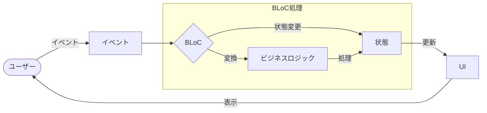
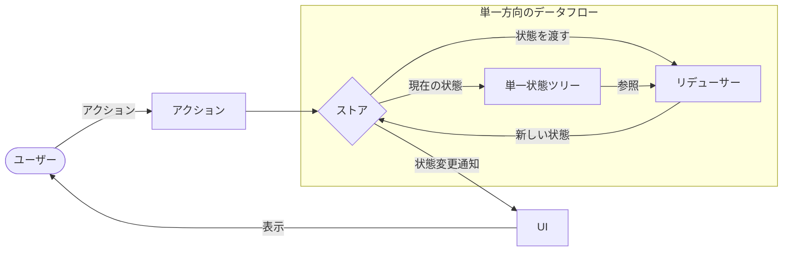
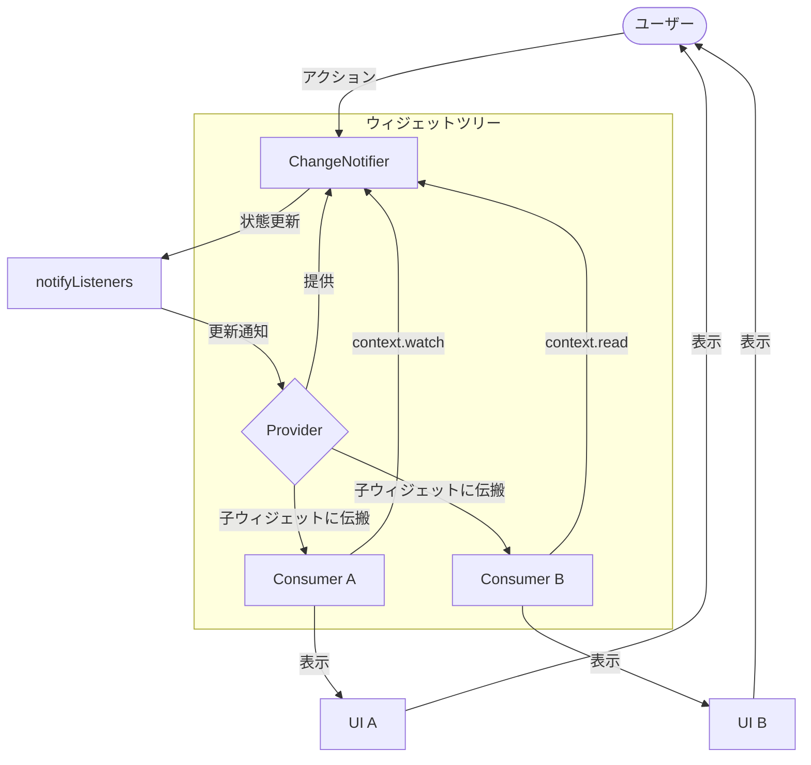
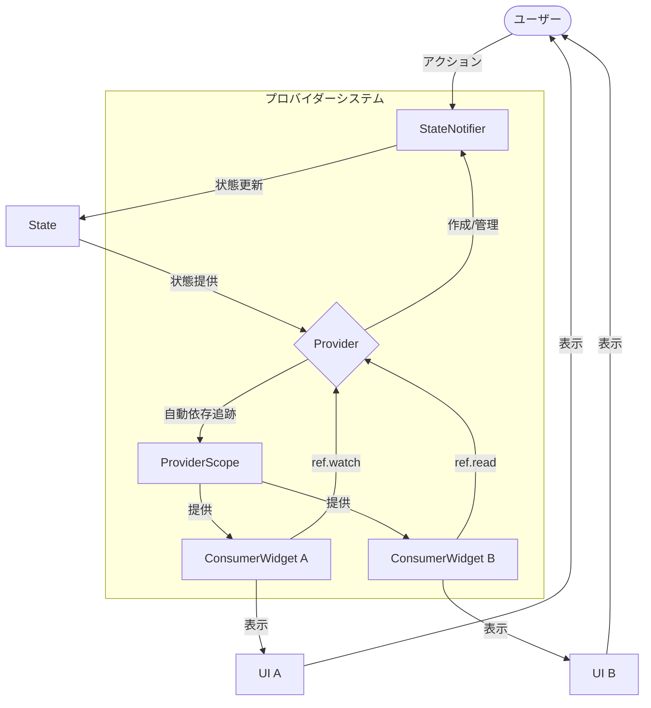

# Flutter状態管理の基礎

## 状態管理の概念

状態管理とは、アプリケーションのデータや状態を効率的に管理し、UIがその状態の変化に応じて適切に更新される仕組み。Flutterにおける「状態」とは、アプリが動作中に変化するデータを指す。

**状態の例:**
- ユーザー入力データ
- API/サーバーからのレスポンスデータ
- 現在のページ/画面の情報
- ログイン状態
- アプリの表示設定

## アプリと非同期処理と状態管理

モバイルアプリにおける主な非同期処理:

| 非同期処理の種類 | 例 |
|-----------------|-----|
| サーバー通信 | APIリクエストの送信と応答の待機 |
| データベース操作 | ローカルデータの読み書き |
| ファイル操作 | 画像のダウンロードや保存 |
| ユーザー入力 | 入力完了待ち |

## 状態管理のユースケース

### APIサーバーとの通信における状態管理

| 状態 | 詳細 | UI対応 |
|------|------|--------|
| 読み込み中 | リクエスト送信中でレスポンス待ち | ローディングインジケーター表示、操作無効化 |
| 読み込み完了 | データの取得に成功 | 取得データを表示、関連UIを更新 |
| 読み込みエラー | リクエストが失敗 | エラーメッセージ表示、再試行オプション提供 |

### 状態管理が必要な機能例

| 機能 | 状態管理内容 |
|------|-------------|
| Pull-to-refresh | スクロールイベント監視、更新中状態管理、データ更新 |
| 無限スクロール | スクロール位置監視、追加データ取得状態、リスト拡張 |
| 検索バーのサジェスト | ユーザー入力監視、サジェスト候補取得、結果表示 |
| デバウンス処理 | 短時間の連続処理制限、最終入力後の処理実行 |
| リクエストキャンセル | ページ離脱時のリクエスト中断、新規リクエスト時の古いリクエスト中断 |
| 楽観的UI | 即時UI更新、サーバー処理失敗時の復元 |
| オフラインモード | ネットワーク状態監視、ローカルデータ使用、同期処理 |

## 主要な状態管理手法/ライブラリの比較

### 基本特性比較

| 状態管理手法 | 複雑さ | 学習曲線 | 適したプロジェクト規模 | 型安全性 | 非同期サポート |
|-------------|-------|---------|----------------------|---------|-------------|
| StatefulWidget | 低 | 易 | 小 | 中 | 低 |
| Provider | 中 | 中 | 小-中 | 中 | 中 |
| BLoC | 高 | 高 | 中-大 | 高 | 高 |
| Redux | 高 | 高 | 大 | 中 | 中 |
| Riverpod | 高 | 中-高 | 中-大 | 高 | 高 |

### 詳細比較

| 状態管理手法 | 長所 | 短所 | 使用パターン |
|-------------|------|------|-------------|
| StatefulWidget | シンプルで理解しやすい、小規模向け | ウィジェット間共有困難、深いツリーで非効率 | 単一ウィジェット内の状態管理 |
| Provider | 直感的API、依存注入パターン | 複雑な状態遷移には不向き | 中規模アプリの状態共有 |
| BLoC | ビジネスロジックとUIの明確な分離、強力な非同期処理 | ボイラープレートが多い | 複雑な状態遷移、非同期重視 |
| Redux | 予測可能な状態変化、厳格なアーキテクチャ | コード量が多い、学習コスト高 | 大規模アプリ、複雑な状態管理 |
| Riverpod | 完全な型安全性、自動依存関係追跡 | Providerより複雑 | 中-大規模アプリ、型安全重視 |

## 各状態管理手法の詳細

### 1. StatefulWidget

最も基本的な状態管理メカニズム。

**特徴:**
- シンプルで理解しやすい
- 小規模な状態管理に適している
- ウィジェットツリーの特定部分に閉じた状態管理

**制限:**
- ウィジェット間での状態共有が難しい
- 深いウィジェットツリーでの状態更新が非効率
- 大規模アプリでは管理が複雑になる

**サンプルコード:**
```dart
class CounterWidget extends StatefulWidget {
  @override
  _CounterWidgetState createState() => _CounterWidgetState();
}

class _CounterWidgetState extends State<CounterWidget> {
  int _counter = 0;

  void _incrementCounter() {
    setState(() {
      _counter++;
    });
  }

  @override
  Widget build(BuildContext context) {
    return Column(
      children: [
        Text('Count: $_counter'),
        ElevatedButton(
          onPressed: _incrementCounter,
          child: Text('Increment'),
        ),
      ],
    );
  }
}
```

### 2. InheritedWidget

ウィジェットツリーを通じて下位のウィジェットにデータを効率的に渡す基盤。多くの状態管理ライブラリはInheritedWidgetをベースにしている。

**特徴:**
- ウィジェットツリー全体でデータを共有可能
- 効率的な再描画の制御
- 多くの状態管理ライブラリの基盤

**制限:**
- 直接使うにはボイラープレートコードが多い
- 複雑な状態管理には向かない

**サンプルコード:**
```dart
class CounterProvider extends InheritedWidget {
  final int counter;
  final Function incrementCounter;

  CounterProvider({
    Key? key,
    required this.counter,
    required this.incrementCounter,
    required Widget child,
  }) : super(key: key, child: child);

  static CounterProvider of(BuildContext context) {
    return context.dependOnInheritedWidgetOfExactType<CounterProvider>()!;
  }

  @override
  bool updateShouldNotify(CounterProvider oldWidget) {
    return counter != oldWidget.counter;
  }
}
```

### 3. Provider

GoogleがFlutterアプリで推奨する状態管理ライブラリの一つ。InheritedWidgetをベースに使いやすいAPIを提供。

**特徴:**
- シンプルで直感的なAPI
- 依存関係の注入(DI)のようなパターンをサポート
- ウィジェットの効率的な再構築

**サンプルコード:**
```dart
// データモデル
class Counter with ChangeNotifier {
  int _count = 0;
  int get count => _count;

  void increment() {
    _count++;
    notifyListeners();
  }
}

// メインアプリ
void main() {
  runApp(
    ChangeNotifierProvider(
      create: (context) => Counter(),
      child: MyApp(),
    ),
  );
}

// 消費側ウィジェット
class CounterDisplay extends StatelessWidget {
  @override
  Widget build(BuildContext context) {
    return Text(
      '${context.watch<Counter>().count}',
    );
  }
}

class CounterIncrementer extends StatelessWidget {
  @override
  Widget build(BuildContext context) {
    return ElevatedButton(
      onPressed: () => context.read<Counter>().increment(),
      child: Text('Increment'),
    );
  }
}
```

### 4. BLoC (Business Logic Component)

イベントとストリームに基づく状態管理パターン。RxDartと組み合わせて使用されることが多い。

**特徴:**
- ビジネスロジックとUIの明確な分離
- 非同期処理とイベント処理が強力
- テスタビリティが高い

**サンプルコード:**
```dart
// BLoCクラス
class CounterBloc {
  final _counterStateController = StreamController<int>.broadcast();
  final _counterEventController = StreamController<CounterEvent>();
  
  Stream<int> get counter => _counterStateController.stream;
  Sink<CounterEvent> get counterEventSink => _counterEventController.sink;
  
  int _counter = 0;
  
  CounterBloc() {
    _counterEventController.stream.listen(_mapEventToState);
  }
  
  void _mapEventToState(CounterEvent event) {
    if (event is IncrementEvent) {
      _counter++;
    } else if (event is DecrementEvent) {
      _counter--;
    }
    _counterStateController.add(_counter);
  }
  
  void dispose() {
    _counterStateController.close();
    _counterEventController.close();
  }
}

// イベント
abstract class CounterEvent {}
class IncrementEvent extends CounterEvent {}
class DecrementEvent extends CounterEvent {}
```

### 5. Redux

一方向データフローと単一の状態ストアに基づく状態管理パターン。

**特徴:**
- 予測可能な状態変化
- 時間旅行デバッグのサポート
- 厳格なアーキテクチャ

**サンプルコード:**
```dart
// アクション
enum Actions { Increment, Decrement }

// 状態
class AppState {
  final int counter;
  
  AppState({this.counter = 0});
  
  AppState copyWith({int? counter}) {
    return AppState(
      counter: counter ?? this.counter,
    );
  }
}

// リデューサー
AppState reducer(AppState state, dynamic action) {
  if (action == Actions.Increment) {
    return state.copyWith(counter: state.counter + 1);
  } else if (action == Actions.Decrement) {
    return state.copyWith(counter: state.counter - 1);
  }
  return state;
}
```

### 6. Riverpod

Providerの進化版で、より型安全で柔軟な状態管理を提供。

**特徴:**
- コンパイル時の型安全性
- プロバイダーの自動破棄
- テスト容易性が高い

**サンプルコード:**
```dart
// プロバイダー定義
final counterProvider = StateNotifierProvider<CounterNotifier, int>((ref) {
  return CounterNotifier();
});

// 状態管理クラス
class CounterNotifier extends StateNotifier<int> {
  CounterNotifier() : super(0);
  
  void increment() => state++;
  void decrement() => state--;
}

// 使用例
class CounterWidget extends ConsumerWidget {
  @override
  Widget build(BuildContext context, WidgetRef ref) {
    final count = ref.watch(counterProvider);
    
    return Column(
      children: [
        Text('Count: $count'),
        ElevatedButton(
          onPressed: () => ref.read(counterProvider.notifier).increment(),
          child: Text('Increment'),
        ),
      ],
    );
  }
}
```

## 状態管理パターンの選択基準

適切な状態管理パターンの選択には以下の要素を考慮:

1. **プロジェクトの規模**: 小規模プロジェクトではStatefulWidgetやProvider、大規模プロジェクトではBLoC、Redux、Riverpodなどが適している

2. **チームの経験**: チームが馴染みのあるパターンを採用するとスムーズに開発できる

3. **アプリの複雑性**: 複雑な状態遷移が多いアプリではBLoCやReduxが適している

4. **非同期処理の量**: 多数の非同期処理を扱う場合はRiverpodやBLoCが強み

5. **パフォーマンス要件**: 効率的な再描画が重要な場合はInheritedWidgetベースのライブラリが有利

## 主要状態管理パターンの概念と思想

各状態管理パターンは、異なる設計思想と解決アプローチに基づいている。

### パターン間の設計思想比較

| 状態管理手法 | 基本思想 | 核心概念 | 例えるなら |
|-------------|---------|---------|-----------|
| **BLoC** | イベント入力と状態出力のストリーム処理 | • ストリームベース<br>• 単方向データフロー<br>• 関心の分離 | 工場のコンベアベルト。イベント（原材料）が流れてきて、BLoC（工場の機械）が処理し、状態（製品）として出力される |
| **Redux** | 純粋関数による予測可能な状態変更 | • 単一の状態ツリー<br>• 状態は読取専用<br>• リデューサーは純粋関数 | 会計帳簿。すべての取引（アクション）は記録され、現在の残高（状態）は過去のすべての取引の結果。直接残高を書き換えることは禁止 |
| **Provider** | シンプルな依存性注入と変更通知 | • 依存性注入<br>• リアクティブ更新<br>• ボイラープレート削減 | 図書館の本の貸出システム。本（データ）は中央で管理され、必要な人（Widget）が必要な時に借りて使う。本が更新されると関心のある人だけに通知される |
| **Riverpod** | Providerの進化系で型安全性と依存関係の自動管理を実現 | • 完全な型安全性<br>• プロバイダーオーバーライド<br>• 自動依存関係追跡<br>• 自動破棄 | スマートな図書館システム。本（データ）は種類ごとに整理されていて、利用者（Widget）の利用傾向を分析し、不要な本は自動的に除籍される。また、本を探す前にカテゴリが間違っていればシステムがエラーを出す |

### データフローの違い

| 状態管理手法 | データの流れ | 状態変更の方法 | UIへの通知方法 |
|-------------|-------------|--------------|--------------|
| **BLoC** | イベント → BLoC → 状態 → UI | イベントをBLoCに追加 | Streamを監視（StreamBuilder） |
| **Redux** | アクション → ディスパッチャー → リデューサー → ストア → UI | アクションをディスパッチ | StoreConnectorでストアを監視 |
| **Provider** | アクション → ChangeNotifier → UI | モデルのメソッド直接呼び出し | ChangeNotifierProviderとconsumer/watchによる監視 |
| **Riverpod** | アクション → StateNotifier → State → UI | プロバイダーNotifierのメソッド呼び出し | ref.watchによるプロバイダー監視 |

### 使い分けのガイドライン

| パターン | 最適な用途 | 不向きな用途 |
|---------|-----------|------------|
| **BLoC** | • 複雑な非同期処理が多いアプリ<br>• ビジネスロジックの分離が重要な場合 | • 小規模アプリ<br>• シンプルな状態管理 |
| **Redux** | • 状態変化の追跡が重要なアプリ<br>• 複雑な状態遷移のデバッグが必要な場合 | • 迅速な開発が必要な場合<br>• 小中規模アプリ |
| **Provider** | • 中小規模アプリ<br>• シンプルなAPIを求める場合 | • 複雑な依存関係がある場合<br>• 大規模アプリケーション |
| **Riverpod** | • 型安全性を重視する場合<br>• テスト容易性が必要な場合 | • コードの簡潔さを最優先する場合 |

### 具体例：TODOアプリでのタスク追加処理

各パターンでの「買い物に行く」タスク追加の実装例：

```dart
// BLoC
bloc.add(AddTaskEvent('買い物に行く'));
// UIはblocの状態ストリームを監視して更新

// Redux
store.dispatch(AddTaskAction('買い物に行く'));
// リデューサーが新しい状態を生成、UIは更新

// Provider
Provider.of<TaskModel>(context, listen: false).addTask('買い物に行く');
// notifyListenersが呼ばれ、依存Widgetが再構築

// Riverpod
ref.read(taskProvider.notifier).addTask('買い物に行く');
// 状態更新され、依存Widgetが再構築
```

### 実装の複雑さと特徴

| パターン | コード量 | 学習コスト | テスト容易性 | 状態追跡 | 非同期サポート |
|---------|---------|-----------|------------|---------|--------------|
| **BLoC** | 多い | 高い | 高い | 中程度 | 強力 |
| **Redux** | 最も多い | 最も高い | 高い | 最も優れている | 中程度 |
| **Provider** | 少ない | 低い | 中程度 | 低い | 中程度 |
| **Riverpod** | 中程度 | 中程度 | 最も高い | 中程度 | 強力 |

## 参考：主要な状態管理パターンの図解

### BLoCパターン



### Reduxパターン



### Providerパターン



### Riverpodパターン

