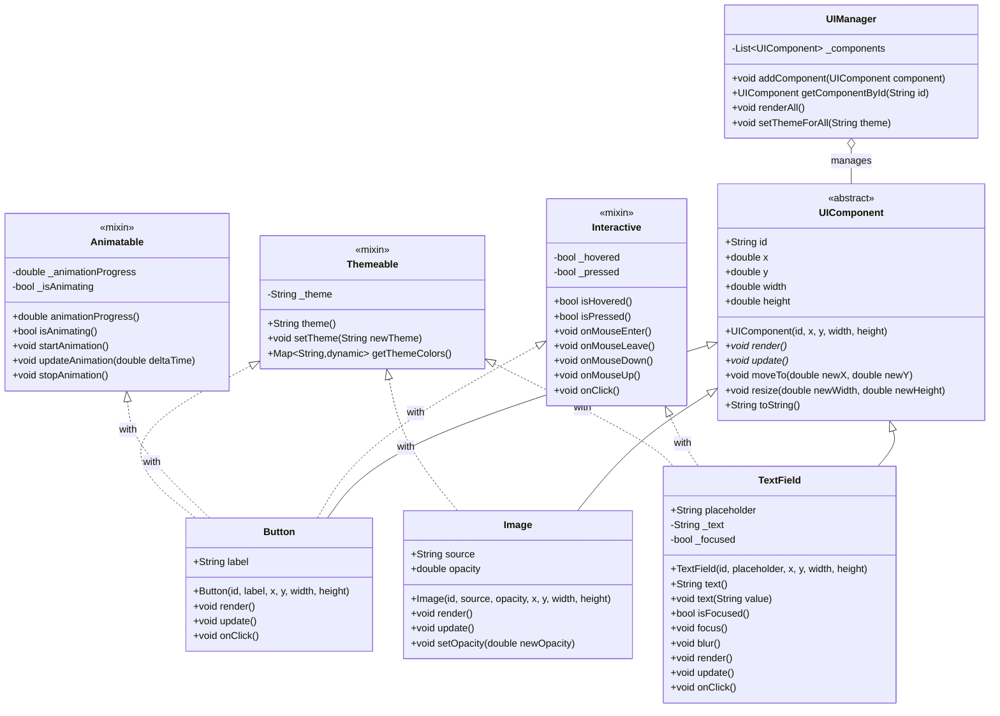

# Dart高度オブジェクト指向プログラミング

## 目次
1. [カプセル化](#カプセル化)
2. [ポリモーフィズム](#ポリモーフィズム)
3. [抽象化](#抽象化)
4. [ミックスイン](#ミックスイン)
5. [継承とミックスインの比較](#継承とミックスインの比較)
6. [実践的なコード例](#実践的なコード例)

## カプセル化

### 定義と目的
カプセル化はオブジェクト指向プログラミングの4つの柱の一つで、クラスの内部データを外部から直接アクセスできないように保護し、制御されたインターフェースを通じてのみアクセス可能にする機能。

### 実装方法

| 要素 | 構文 | 役割 |
|------|------|------|
| プライベート変数 | `_変数名` | 外部からの直接アクセスを制限。同じライブラリ内からのみアクセス可能 |
| ゲッター | `Type get 名前 => _変数;` | 変数値の読み取り専用インターフェースを提供 |
| 計算プロパティ | `Type get 名前 => _変数1 * _変数2;` | 計算結果を返すプロパティ |
| セッター | `set 名前(Type 値) { /* 検証ロジック */ }` | 変数値の設定インターフェース（バリデーション可能） |

### カプセル化の利点
- データの整合性を保護（無効な状態を防止）
- 内部実装の変更に強い（実装の詳細を隠蔽）
- コードの保守性と再利用性の向上
- インターフェースの安定性を提供

### カプセル化における重要ポイント
- Dartのプライベートスコープはクラスレベルではなく**ライブラリレベル**
- プライベート変数の命名規則はアンダースコア始まり（`_name`）
- イミュータブルなオブジェクトを作成するには`final`キーワードを使用し、ゲッターのみを提供
- 複雑なロジックはセッター内ではなく、専用メソッドとして実装すべき
- 状態変更は最小限に抑え、予測可能性を高めることを推奨

### カプセル化の実装例
```dart
class BankAccount {
  final String _accountNumber;
  final String _ownerName;
  double _balance;

  BankAccount(this._accountNumber, this._ownerName, [this._balance = 0.0]);

  // 読み取り専用プロパティ
  String get accountNumber => _accountNumber;
  String get ownerName => _ownerName;
  double get balance => _balance;

  // 計算プロパティ
  bool get isOverdrawn => _balance < 0;

  // 状態を変更するメソッド（セッターではなくメソッドを推奨）
  void deposit(double amount) {
    if (amount <= 0) {
      throw ArgumentError('預金額は0より大きい必要があります');
    }
    _balance += amount;
  }

  bool withdraw(double amount) {
    if (amount <= 0) {
      throw ArgumentError('引き出し額は0より大きい必要があります');
    }
    
    if (_balance >= amount) {
      _balance -= amount;
      return true;
    }
    return false;
  }

  @override
  String toString() => 'BankAccount($_accountNumber, $_ownerName, $_balance)';
}
```


## ポリモーフィズム

### 定義と目的
ポリモーフィズム（多態性）は同じインターフェースを持つ異なるクラスのオブジェクトが、同じメッセージに対して異なる動作を示す能力。「多くの形態を持つ」という意味で、オブジェクト指向プログラミングの強力な特性。

### 実装方法

| 要素 | 説明 | 例 |
|------|------|-----|
| メソッドオーバーライド | 親クラスのメソッドを子クラスで再定義 | 子クラスが親クラスのメソッドを独自の実装で上書き |
| `@override`アノテーション | オーバーライドの明示（推奨） | コンパイラに対して意図的なオーバーライドであることを通知 |
| 動的ディスパッチ | 実行時に適切なメソッド実装を選択 | 親クラス型の変数で子クラスのインスタンスを参照しても、子クラスの実装が呼ばれる |

### ポリモーフィズムの利点
- コードの拡張性の向上（新しいサブクラスの追加が容易）
- コードの再利用性の促進
- インターフェースと実装の分離
- 依存性の低減（抽象型に依存し、具体的な実装には依存しない）
- テストの容易さ（モックオブジェクトの使用が容易）

### ポリモーフィズムの実装例
```dart
// 支払い方法の抽象基底クラス
abstract class PaymentMethod {
  String get name;
  bool processPayment(double amount);
}

// クレジットカード決済の実装
class CreditCardPayment extends PaymentMethod {
  final String cardNumber;
  final String cardHolderName;
  final String expiryDate;
  final String cvv;

  CreditCardPayment({
    required this.cardNumber,
    required this.cardHolderName,
    required this.expiryDate,
    required this.cvv,
  });

  @override
  String get name => 'クレジットカード';

  @override
  bool processPayment(double amount) {
    print('$cardHolderName 様のクレジットカード($cardNumber)で$amount円を決済しています...');
    // 実際の決済処理
    return true; // 成功を想定
  }
}

// PayPal決済の実装
class PayPalPayment extends PaymentMethod {
  final String email;
  final String password;

  PayPalPayment({required this.email, required this.password});

  @override
  String get name => 'PayPal';

  @override
  bool processPayment(double amount) {
    print('PayPalアカウント($email)で$amount円を決済しています...');
    // 実際の決済処理
    return true; // 成功を想定
  }
}

// 銀行振込決済の実装
class BankTransferPayment extends PaymentMethod {
  final String bankName;
  final String accountNumber;
  final String accountHolderName;

  BankTransferPayment({
    required this.bankName,
    required this.accountNumber,
    required this.accountHolderName,
  });

  @override
  String get name => '銀行振込';

  @override
  bool processPayment(double amount) {
    print('$bankName銀行の口座($accountNumber)へ$amount円を振り込み中...');
    // 実際の決済処理
    return true; // 成功を想定
  }
}

// 注文処理クラス（ポリモーフィズムを活用）
class OrderProcessor {
  bool processOrder(double amount, PaymentMethod paymentMethod) {
    print('${paymentMethod.name}で決済を開始します');
    bool result = paymentMethod.processPayment(amount);
    
    if (result) {
      print('決済が完了しました');
      return true;
    } else {
      print('決済に失敗しました');
      return false;
    }
  }
}

void main() {
  // 異なる支払い方法のインスタンスを作成
  final creditCard = CreditCardPayment(
    cardNumber: '1234-5678-9012-3456',
    cardHolderName: '山田太郎',
    expiryDate: '12/25',
    cvv: '123',
  );
  
  final paypal = PayPalPayment(
    email: 'taro@example.com',
    password: 'password123',
  );
  
  final bankTransfer = BankTransferPayment(
    bankName: 'みずほ',
    accountNumber: '1234567',
    accountHolderName: '山田太郎',
  );
  
  // 注文処理クラスのインスタンスを作成
  final orderProcessor = OrderProcessor();
  
  // 異なる支払い方法で同じメソッドを呼び出す（ポリモーフィズム）
  print('=== クレジットカード決済 ===');
  orderProcessor.processOrder(10000, creditCard);
  
  print('\n=== PayPal決済 ===');
  orderProcessor.processOrder(10000, paypal);
  
  print('\n=== 銀行振込決済 ===');
  orderProcessor.processOrder(10000, bankTransfer);
}
```


## 抽象化

### 定義と目的
抽象化は複雑なシステムから本質的な詳細のみを抽出し、不必要な詳細を隠すプロセス。インターフェースと実装を分離し、システムの複雑性を管理するために不可欠。

### 実装方法

| 要素 | 構文 | 特徴 |
|------|------|------|
| 抽象クラス | `abstract class クラス名 {...}` | インスタンス化不可、抽象メソッドと具象メソッドの両方を含める可能 |
| 抽象メソッド | `Type メソッド名();` | 実装なし（シグネチャのみ）、サブクラスでの実装が必須 |
| 具象メソッド | `Type メソッド名() {...}` | 実装を含む、サブクラスでオーバーライド可能だが必須ではない |
| 抽象プロパティ | `Type get プロパティ名;` | 実装なし、サブクラスでの実装が必須 |

### 抽象化の利点
- コードの複雑さの管理
- 実装の詳細からの保護
- 拡張性と柔軟性の向上
- コードの再利用性の促進
- 依存性の減少（実装ではなくインターフェースに依存）

### 抽象化における重要ポイント
- 抽象クラスはインスタンス化できない（`AbstractClass obj = AbstractClass();` はエラー）
- 抽象メソッドは抽象クラス内でのみ定義可能
- 抽象クラスは通常のメソッド実装も含むことができる（完全なインターフェース定義と部分的な実装の両方が可能）
- サブクラスは全ての抽象メソッドを実装するか、自身も抽象クラスとして宣言する必要がある
- 抽象クラスはコンストラクタを持つことができる（サブクラスからのみ呼び出し可能）

### 抽象化の実装例
```dart
// メディアプレーヤーの抽象クラス
abstract class MediaPlayer {
  // 抽象プロパティ
  String get name;
  bool get isPlaying;
  
  // 抽象メソッド（実装なし）
  void play();
  void pause();
  void stop();
  
  // 具象メソッド（実装あり）
  void printStatus() {
    print('$name: ${isPlaying ? "再生中" : "停止中"}');
  }
  
  // ファクトリーメソッド
  factory MediaPlayer.create(String type) {
    switch (type) {
      case 'audio':
        return AudioPlayer();
      case 'video':
        return VideoPlayer();
      default:
        throw ArgumentError('不明なメディアタイプ: $type');
    }
  }
}

// オーディオプレーヤーの実装
class AudioPlayer extends MediaPlayer {
  bool _playing = false;
  
  @override
  String get name => 'オーディオプレーヤー';
  
  @override
  bool get isPlaying => _playing;
  
  @override
  void play() {
    _playing = true;
    print('$name: 音楽再生開始');
  }
  
  @override
  void pause() {
    _playing = false;
    print('$name: 音楽一時停止');
  }
  
  @override
  void stop() {
    _playing = false;
    print('$name: 音楽停止');
  }
  
  // クラス固有のメソッド
  void setEqualizer(String preset) {
    print('$name: イコライザーを $preset に設定');
  }
}

// ビデオプレーヤーの実装
class VideoPlayer extends MediaPlayer {
  bool _playing = false;
  
  @override
  String get name => 'ビデオプレーヤー';
  
  @override
  bool get isPlaying => _playing;
  
  @override
  void play() {
    _playing = true;
    print('$name: 動画再生開始');
  }
  
  @override
  void pause() {
    _playing = false;
    print('$name: 動画一時停止');
  }
  
  @override
  void stop() {
    _playing = false;
    print('$name: 動画停止');
  }
  
  // クラス固有のメソッド
  void setResolution(String resolution) {
    print('$name: 解像度を $resolution に設定');
  }
}

void main() {
  // 抽象クラスを使った多態的な処理
  List<MediaPlayer> players = [
    MediaPlayer.create('audio'),
    MediaPlayer.create('video'),
  ];
  
  // すべてのプレーヤーを操作
  for (var player in players) {
    player.play();
    player.printStatus();
    player.pause();
    player.printStatus();
    print('---');
  }
  
  // 個別の型として扱う場合
  AudioPlayer audioPlayer = AudioPlayer();
  audioPlayer.play();
  audioPlayer.setEqualizer('Bass Boost');
  audioPlayer.stop();
  
  VideoPlayer videoPlayer = VideoPlayer();
  videoPlayer.play();
  videoPlayer.setResolution('1080p');
  videoPlayer.stop();
}
```


## ミックスイン

### 定義と目的
ミックスインはクラス階層の外部から機能を再利用する方法。多重継承の代替として、複数のクラスに共通の機能を提供するために使用される。

### 実装方法

| 要素 | 構文 | 説明 |
|------|------|------|
| ミックスイン定義 | `mixin 名前 {...}` | 再利用可能な機能セットを定義 |
| ミックスイン使用 | `class クラス名 with ミックスイン1, ミックスイン2 {...}` | 複数のミックスインを組み合わせ可能 |
| 制限付きミックスイン | `mixin 名前 on クラス名 {...}` | 特定のクラス階層でのみ使用可能なミックスイン |
| ミックスインの優先順位 | `class A with B, C {...}` | 後に指定したミックスイン（C）が優先される |

### ミックスインの特徴
- コンストラクタを持てない（初期化ロジックはメソッドで代用）
- 単独でインスタンス化できない（クラスとミックスインする必要がある）
- 複数のミックスインを組み合わせ可能（水平方向の機能拡張）
- 「on」キーワードで使用可能なクラスを制限できる
- Dartの`with`キーワードを使用して適用する
- ミックスインの適用順序が重要（メソッド衝突時は最後に指定したものが優先）

### ミックスインの利点
- コードの再利用性の向上
- 多重継承の問題回避（ダイヤモンド問題など）
- 柔軟な機能の組み合わせ
- 横断的関心事の分離（ロギング、検証など）

### ミックスインの実装例
```dart
// ロギング機能のミックスイン
mixin Logger {
  void log(String message) {
    final timestamp = DateTime.now().toString();
    print('[$timestamp] $message');
  }
  
  void logError(String message, [Exception? e]) {
    final timestamp = DateTime.now().toString();
    if (e != null) {
      print('[$timestamp] ERROR: $message - ${e.toString()}');
    } else {
      print('[$timestamp] ERROR: $message');
    }
  }
}

// 検証機能のミックスイン
mixin Validator {
  bool validateEmail(String email) {
    final emailRegExp = RegExp(r'^[\w-\.]+@([\w-]+\.)+[\w-]{2,4}$');
    return emailRegExp.hasMatch(email);
  }
  
  bool validatePassword(String password) {
    // 8文字以上、1つ以上の数字と特殊文字を含む
    return password.length >= 8 && 
           password.contains(RegExp(r'[0-9]')) && 
           password.contains(RegExp(r'[!@#$%^&*(),.?":{}|<>]'));
  }
}

// HTTPリクエスト機能のミックスイン
mixin HttpRequester {
  Future<void> get(String url) async {
    print('GET request to $url');
    // 実際のHTTPリクエスト処理
  }
  
  Future<void> post(String url, Map<String, dynamic> data) async {
    print('POST request to $url with data: $data');
    // 実際のHTTPリクエスト処理
  }
}

// 特定のクラスに制限されたミックスイン
// AuthenticatedHttpRequesterはHttpRequesterを使用するクラスでのみ使用可能
mixin AuthenticatedHttpRequester on HttpRequester {
  String _authToken = '';
  
  void setAuthToken(String token) {
    _authToken = token;
  }
  
  @override
  Future<void> get(String url) async {
    print('Authenticated GET request to $url with token: $_authToken');
    // 認証トークンを含むリクエスト処理
    await super.get(url);
  }
  
  @override
  Future<void> post(String url, Map<String, dynamic> data) async {
    print('Authenticated POST request to $url with token: $_authToken');
    // 認証トークンを含むリクエスト処理
    await super.post(url, data);
  }
}

// APIサービスクラス（複数のミックスインを組み合わせ）
class ApiService with Logger, Validator, HttpRequester, AuthenticatedHttpRequester {
  final String baseUrl;
  
  ApiService(this.baseUrl);
  
  Future<void> login(String email, String password) async {
    log('ログイン試行: $email');
    
    if (!validateEmail(email)) {
      logError('無効なメールアドレス: $email');
      throw ArgumentError('無効なメールアドレス');
    }
    
    if (!validatePassword(password)) {
      logError('無効なパスワード形式');
      throw ArgumentError('無効なパスワード形式');
    }
    
    try {
      await post('$baseUrl/login', {
        'email': email,
        'password': password,
      });
      
      // 認証成功時の処理
      setAuthToken('sample-token-12345');
      log('ログイン成功: $email');
    } catch (e) {
      logError('ログイン失敗', e as Exception);
      rethrow;
    }
  }
  
  Future<void> fetchUserData(int userId) async {
    log('ユーザーデータ取得: $userId');
    
    try {
      await get('$baseUrl/users/$userId');
      log('ユーザーデータ取得成功: $userId');
    } catch (e) {
      logError('ユーザーデータ取得失敗', e as Exception);
      rethrow;
    }
  }
}

void main() async {
  final apiService = ApiService('https://api.example.com');
  
  try {
    await apiService.login('user@example.com', 'P@ssw0rd!');
    await apiService.fetchUserData(123);
  } catch (e) {
    print('エラーが発生しました: $e');
  }
}
```


## 継承とミックスインの比較

### 基本的な違い

| 特性 | 継承（extends） | ミックスイン（with） |
|------|----------------|-------------------|
| 関係性 | 「is-a」関係（垂直方向） | 「has-ability」関係（水平方向） |
| 数量制限 | 単一継承のみ | 複数ミックスイン可能 |
| 階層構造 | 階層的 | 非階層的 |
| 構造 | サブクラスとスーパークラス | ホストクラスとミックスイン |
| メソッド解決 | スーパークラスを先に検索 | ミックスインをリスト順に検索 |
| 用途 | 基本的な構造と振る舞いの共有 | 特定の機能（能力）の再利用 |
| インスタンス化 | 単独でインスタンス化可能 | 単独ではインスタンス化不可 |
| コンストラクタ | 持つことができる | 持つことができない |

### 詳細比較

| 機能 | 継承 | ミックスイン |
|------|------|------------|
| `super`キーワード | 親クラスのメソッド呼び出し可能 | 直前のミックスインまたはクラスのメソッド呼び出し可能 |
| 型の扱い | サブクラスはスーパークラスの型として扱える | ミックスインを使用したクラスはミックスインの型として扱えない |
| コードの再利用 | 縦方向（階層的）に機能を提供 | 横方向（非階層的）に機能を提供 |
| 主な利点 | 明確な分類関係、階層的設計 | 柔軟な機能組み合わせ、多重継承の問題回避 |
| 設計の焦点 | 「何であるか」を表現 | 「何ができるか」を表現 |

### 使い分けの指針

| 使用すべき状況 | 継承 | ミックスイン |
|--------------|------|------------|
| クラス間に明確な「is-a」関係がある場合 | ✓ | |
| 機能を複数のクラスで再利用したい場合 | | ✓ |
| 基本構造と動作を定義する場合 | ✓ | |
| 横断的関心事（ロギング、検証など）を実装する場合 | | ✓ |
| 単一機能の追加が必要な場合 | | ✓ |

## 実践的なコード例

### 継承、ポリモーフィズム、抽象化、ミックスインを組み合わせた例

```dart
// 抽象基底クラス：UIコンポーネント
abstract class UIComponent {
  String id;
  double x;
  double y;
  double width;
  double height;
  
  UIComponent({
    required this.id,
    this.x = 0,
    this.y = 0,
    this.width = 0,
    this.height = 0,
  });
  
  // 抽象メソッド
  void render();
  void update();
  
  // 共通実装を持つ具象メソッド
  void moveTo(double newX, double newY) {
    x = newX;
    y = newY;
    update();
  }
  
  void resize(double newWidth, double newHeight) {
    width = newWidth;
    height = newHeight;
    update();
  }
  
  @override
  String toString() {
    return '$runtimeType(id: $id, position: [$x, $y], size: [$width, $height])';
  }
}

// インタラクティブな機能を提供するミックスイン
mixin Interactive {
  bool _hovered = false;
  bool _pressed = false;
  
  bool get isHovered => _hovered;
  bool get isPressed => _pressed;
  
  void onMouseEnter() {
    _hovered = true;
    print('マウス侵入');
  }
  
  void onMouseLeave() {
    _hovered = false;
    _pressed = false;
    print('マウス離脱');
  }
  
  void onMouseDown() {
    _pressed = true;
    print('マウスダウン');
  }
  
  void onMouseUp() {
    _pressed = false;
    print('マウスアップ');
  }
  
  void onClick() {
    print('クリック');
  }
}

// アニメーション機能を提供するミックスイン
mixin Animatable {
  double _animationProgress = 0.0;
  bool _isAnimating = false;
  
  double get animationProgress => _animationProgress;
  bool get isAnimating => _isAnimating;
  
  void startAnimation() {
    _isAnimating = true;
    _animationProgress = 0.0;
    print('アニメーション開始');
  }
  
  void updateAnimation(double deltaTime) {
    if (_isAnimating) {
      _animationProgress += deltaTime;
      if (_animationProgress >= 1.0) {
        _animationProgress = 1.0;
        _isAnimating = false;
        print('アニメーション完了');
      }
    }
  }
  
  void stopAnimation() {
    _isAnimating = false;
    print('アニメーション停止');
  }
}

// テーマ対応機能を提供するミックスイン
mixin Themeable {
  String _theme = 'light';
  
  String get theme => _theme;
  
  void setTheme(String newTheme) {
    print('テーマを変更: $_theme → $newTheme');
    _theme = newTheme;
  }
  
  Map<String, dynamic> getThemeColors() {
    switch (_theme) {
      case 'dark':
        return {
          'background': '#333333',
          'foreground': '#FFFFFF',
          'accent': '#61DAFB',
        };
      case 'light':
      default:
        return {
          'background': '#FFFFFF',
          'foreground': '#333333',
          'accent': '#0066CC',
        };
    }
  }
}

// 具象クラス：ボタン
class Button extends UIComponent with Interactive, Animatable, Themeable {
  String label;
  
  Button({
    required super.id,
    required this.label,
    super.x = 0,
    super.y = 0,
    super.width = 100,
    super.height = 40,
  });
  
  @override
  void render() {
    final colors = getThemeColors();
    final state = isPressed ? 'pressed' : (isHovered ? 'hovered' : 'normal');
    
    print('ボタン "$label" をレンダリング:');
    print('  状態: $state');
    print('  テーマ: $theme');
    print('  色: ${colors['background']} / ${colors['foreground']}');
    print('  アニメーション: ${(animationProgress * 100).toStringAsFixed(0)}%');
  }
  
  @override
  void update() {
    print('ボタン "$label" を更新');
    render();
  }
  
  @override
  void onClick() {
    super.onClick();
    startAnimation();
    print('ボタン "$label" がクリックされました');
  }
}

// 具象クラス：画像
class Image extends UIComponent with Themeable {
  String source;
  double opacity;
  
  Image({
    required super.id,
    required this.source,
    this.opacity = 1.0,
    super.x = 0,
    super.y = 0,
    super.width = 200,
    super.height = 200,
  });
  
  @override
  void render() {
    final colors = getThemeColors();
    print('画像 "$source" をレンダリング:');
    print('  不透明度: $opacity');
    print('  テーマ: $theme');
    print('  背景色: ${colors['background']}');
  }
  
  @override
  void update() {
    print('画像 "$source" を更新');
    render();
  }
  
  void setOpacity(double newOpacity) {
    opacity = newOpacity.clamp(0.0, 1.0);
    update();
  }
}

// 具象クラス：入力フィールド
class TextField extends UIComponent with Interactive, Themeable {
  String placeholder;
  String _text = '';
  bool _focused = false;
  
  TextField({
    required super.id,
    required this.placeholder,
    super.x = 0,
    super.y = 0,
    super.width = 200,
    super.height = 30,
  });
  
  String get text => _text;
  set text(String value) {
    _text = value;
    update();
  }
  
  bool get isFocused => _focused;
  
  void focus() {
    _focused = true;
    update();
  }
  
  void blur() {
    _focused = false;
    update();
  }
  
  @override
  void render() {
    final colors = getThemeColors();
    final state = isFocused ? 'フォーカス' : (isHovered ? 'ホバー' : '通常');
    
    print('テキストフィールド をレンダリング:');
    print('  プレースホルダー: $placeholder');
    print('  テキスト: ${_text.isEmpty ? "(空)" : _text}');
    print('  状態: $state');
    print('  テーマ: $theme');
    print('  色: ${colors['background']} / ${colors['foreground']}');
  }
  
  @override
  void update() {
    print('テキストフィールド "$placeholder" を更新');
    render();
  }
  
  @override
  void onClick() {
    super.onClick();
    focus();
  }
}

// UIコンポーネントを管理するクラス
class UIManager {
  final List<UIComponent> _components = [];
  
  void addComponent(UIComponent component) {
    _components.add(component);
    print('コンポーネント追加: ${component.id}');
  }
  
  UIComponent? getComponentById(String id) {
    for (var component in _components) {
      if (component.id == id) {
        return component;
      }
    }
    return null;
  }
  
  void renderAll() {
    print('\n=== 全コンポーネントのレンダリング ===');
    for (var component in _components) {
      component.render();
      print('---');
    }
  }
  
  void setThemeForAll(String theme) {
    print('\n=== 全コンポーネントのテーマを変更: $theme ===');
    for (var component in _components) {
      if (component is Themeable) {
        (component as Themeable).setTheme(theme);
      }
    }
  }
}

void main() {
  // UIマネージャーの作成
  final uiManager = UIManager();
  
  // 各種UIコンポーネントを作成
  final loginButton = Button(
    id: 'btn-login',
    label: 'ログイン',
    width: 120,
    height: 40,
  );
  
  final profileImage = Image(
    id: 'img-profile',
    source: 'profile.jpg',
    width: 100,
    height: 100,
  );
  
  final usernameField = TextField(
    id: 'input-username',
    placeholder: 'ユーザー名',
    width: 200,
    height: 30,
  );
  
  // コンポーネントをマネージャーに追加
  uiManager.addComponent(loginButton);
  uiManager.addComponent(profileImage);
  uiManager.addComponent(usernameField);
  
  // すべてのコンポーネントをレンダリング
  uiManager.renderAll();
  
  // ユーザー操作のシミュレーション
  print('\n=== ユーザー操作のシミュレーション ===');
  
  // テキストフィールドをクリック
  usernameField.onMouseEnter();
  usernameField.onClick();
  
  // テキスト入力
  usernameField.text = 'john_doe';
  
  // ログインボタンをクリック
  loginButton.onMouseEnter();
  loginButton.onMouseDown();
  loginButton.onMouseUp();
  loginButton.onClick();
  
  // テーマを変更
  print('\n=== テーマ変更 ===');
  uiManager.setThemeForAll('dark');
  
  // 変更後のレンダリング
  uiManager.renderAll();
}
```



この実践的な例では、UI要素の階層を作成し、ミックスインを使用して機能を追加しています。この設計により：

1. `UIComponent`抽象クラスは基本構造と振る舞いを定義
2. `Interactive`、`Animatable`、`Themeable`ミックスインで特定の機能を提供
3. 具象クラス（Button、Image、TextField）は抽象クラスを拡張しながら必要なミックスインを組み合わせ
4. 各コンポーネントは必要な機能のみを持ち、不要な機能は含まない
5. 多態性により`UIManager`は様々なコンポーネントを統一的に扱える

### Flutterでの実際の使用例

Flutterアプリケーションでは、これらの概念が以下のように応用されています：

```dart
import 'package:flutter/material.dart';

// 抽象クラス：データモデル
abstract class DataModel {
  String get id;
  Map<String, dynamic> toJson();
  
  @override
  String toString() => '$runtimeType: ${toJson()}';
}

// リポジトリ操作のミックスイン
mixin RepositoryOperations<T extends DataModel> {
  final List<T> _items = [];
  
  List<T> getAll() => List.unmodifiable(_items);
  
  T? getById(String id) {
    try {
      return _items.firstWhere((item) => item.id == id);
    } catch (e) {
      return null;
    }
  }
  
  void add(T item) {
    _items.add(item);
  }
  
  bool update(T item) {
    final index = _items.indexWhere((existingItem) => existingItem.id == item.id);
    if (index >= 0) {
      _items[index] = item;
      return true;
    }
    return false;
  }
  
  bool delete(String id) {
    final initialLength = _items.length;
    _items.removeWhere((item) => item.id == id);
    return _items.length < initialLength;
  }
}

// ログ機能のミックスイン
mixin LoggingOperations {
  void logInfo(String message) {
    final timestamp = DateTime.now().toString();
    print('[$timestamp] INFO: $message');
  }
  
  void logError(String message, [dynamic error]) {
    final timestamp = DateTime.now().toString();
    if (error != null) {
      print('[$timestamp] ERROR: $message - $error');
    } else {
      print('[$timestamp] ERROR: $message');
    }
  }
}

// 具体的なデータモデル
class User implements DataModel {
  @override
  final String id;
  final String username;
  final String email;
  
  User({
    required this.id, 
    required this.username,
    required this.email,
  });
  
  @override
  Map<String, dynamic> toJson() => {
    'id': id,
    'username': username,
    'email': email,
  };
  
  factory User.fromJson(Map<String, dynamic> json) {
    return User(
      id: json['id'],
      username: json['username'],
      email: json['email'],
    );
  }
}

// ユーザーリポジトリ
class UserRepository with RepositoryOperations<User>, LoggingOperations {
  // シングルトンパターン
  static final UserRepository _instance = UserRepository._internal();
  
  factory UserRepository() => _instance;
  
  UserRepository._internal();
  
  @override
  void add(User user) {
    super.add(user);
    logInfo('ユーザー追加: ${user.id} (${user.username})');
  }
  
  @override
  bool delete(String id) {
    final result = super.delete(id);
    if (result) {
      logInfo('ユーザー削除: $id');
    } else {
      logError('ユーザー削除失敗: $id - 見つかりません');
    }
    return result;
  }
  
  // 追加の機能
  List<User> searchByUsername(String query) {
    logInfo('ユーザー検索: "$query"');
    return getAll()
        .where((user) => user.username.toLowerCase().contains(query.toLowerCase()))
        .toList();
  }
}

// アプリケーションのメインウィジェット
class MyApp extends StatelessWidget {
  @override
  Widget build(BuildContext context) {
    return MaterialApp(
      title: 'OOP Demo',
      theme: ThemeData(
        primarySwatch: Colors.blue,
        visualDensity: VisualDensity.adaptivePlatformDensity,
      ),
      home: UserScreen(),
    );
  }
}

// ユーザー画面
class UserScreen extends StatefulWidget {
  @override
  _UserScreenState createState() => _UserScreenState();
}

class _UserScreenState extends State<UserScreen> {
  final UserRepository _userRepository = UserRepository();
  
  @override
  void initState() {
    super.initState();
    
    // サンプルデータ
    _userRepository.add(User(
      id: '1',
      username: 'john_doe',
      email: 'john@example.com',
    ));
    
    _userRepository.add(User(
      id: '2',
      username: 'jane_smith',
      email: 'jane@example.com',
    ));
  }
  
  @override
  Widget build(BuildContext context) {
    final users = _userRepository.getAll();
    
    return Scaffold(
      appBar: AppBar(
        title: Text('ユーザー一覧'),
      ),
      body: ListView.builder(
        itemCount: users.length,
        itemBuilder: (context, index) {
          final user = users[index];
          
          return ListTile(
            title: Text(user.username),
            subtitle: Text(user.email),
            trailing: IconButton(
              icon: Icon(Icons.delete),
              onPressed: () {
                setState(() {
                  _userRepository.delete(user.id);
                });
              },
            ),
          );
        },
      ),
      floatingActionButton: FloatingActionButton(
        child: Icon(Icons.add),
        onPressed: () {
          // 新規ユーザー追加（実際には入力ダイアログなどを表示）
          setState(() {
            _userRepository.add(User(
              id: DateTime.now().millisecondsSinceEpoch.toString(),
              username: 'new_user_${DateTime.now().second}',
              email: 'new${DateTime.now().second}@example.com',
            ));
          });
        },
      ),
    );
  }
}
```


このFlutterの例では、リポジトリパターンを実装し、抽象クラスとミックスインを使用して再利用可能なコンポーネントを作成しています。これにより、コードの保守性と拡張性が向上します。