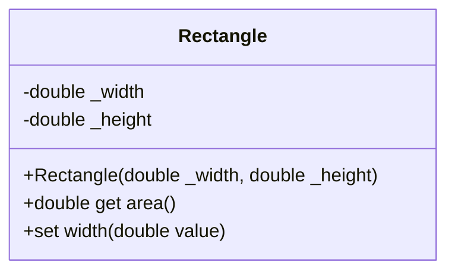
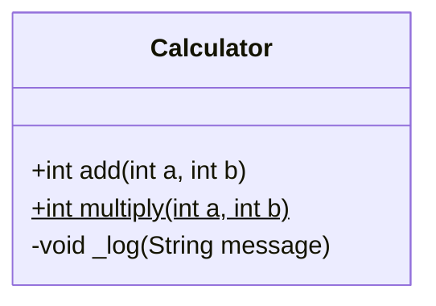
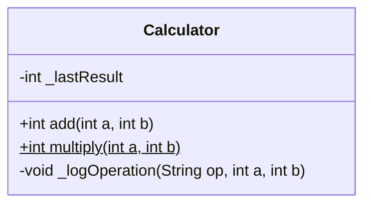
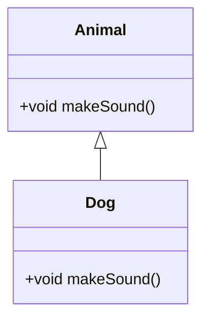
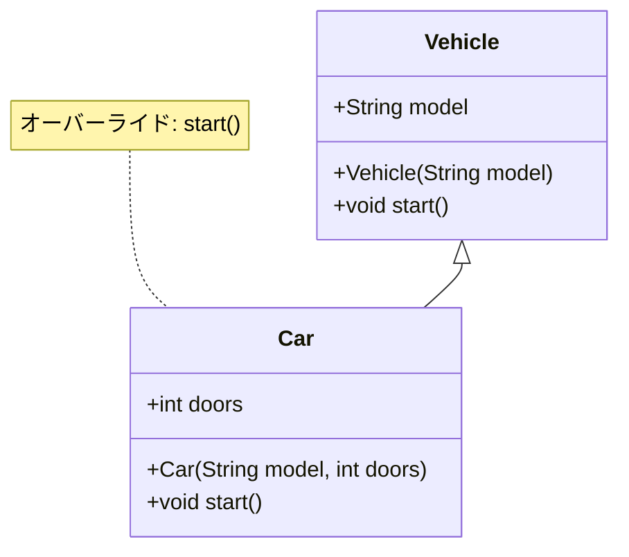
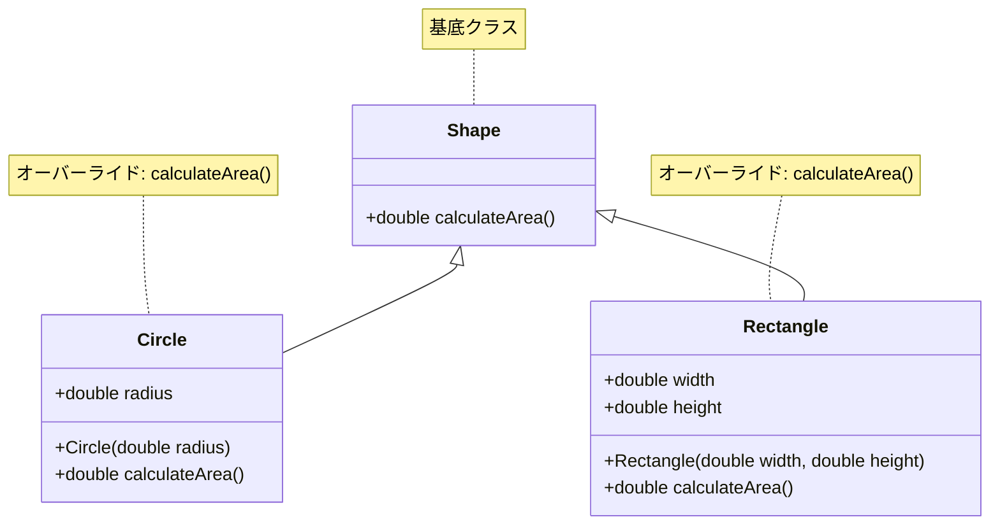
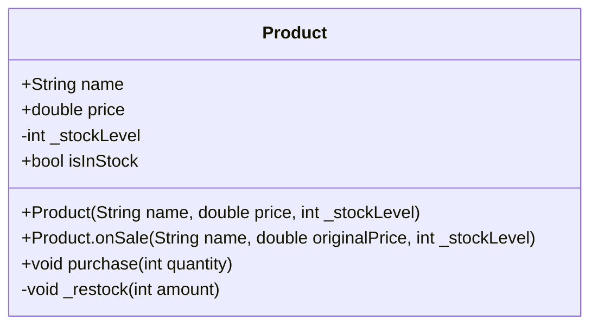
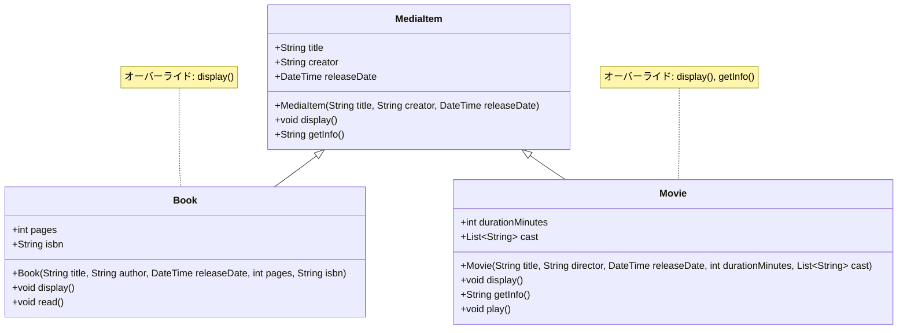
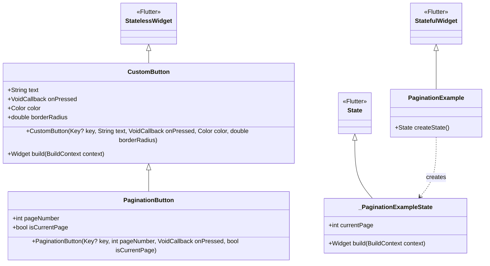

# Dart/Flutterにおけるオブジェクト指向プログラミング基礎

## 1. オブジェクト指向の概念

オブジェクト指向プログラミング(OOP)は、データとその操作を単一の「オブジェクト」としてカプセル化する設計パラダイム。

| 概念 | 説明 |
|------|------|
| クラス | オブジェクトの設計図または型定義 |
| オブジェクト | クラスから生成された実体（インスタンス） |
| カプセル化 | データと操作をひとつの単位に封じ込める |
| 継承 | 既存クラスの特性を新クラスで再利用する仕組み |
| ポリモーフィズム | 同じインターフェースで異なる実装を提供 |

## 2. クラスメンバー

クラスメンバーとは、クラスを構成する要素の総称。クラス内で定義され、そのクラスの特性と振る舞いを規定する。

| メンバーの種類 | 説明 | 例 |
|--------------|------|------|
| 属性（フィールド） | クラスが保持するデータ要素 | `String name;` |
| メソッド | クラスが提供する機能や振る舞い | `void greet() {...}` |
| コンストラクタ | オブジェクト初期化のための特殊メソッド | `Person(this.name);` |
| ゲッター | 属性値を取得するためのアクセサ | `String get fullName => "$first $last";` |
| セッター | 属性値を設定するためのアクセサ | `set age(int value) {...}` |

## 3. クラス定義の基本構成

### 3.1 クラス定義の構文

```dart
class クラス名 {
  // 属性（フィールド、プロパティ）
  データ型 プロパティ名;
  
  // コンストラクタ
  クラス名(パラメータリスト);
  
  // メソッド
  返り値の型 メソッド名(パラメータリスト) {
    // 処理内容
  }
}
```

## 4. コンストラクタの種類

| 種類 | 説明 | 例 |
|------|------|------|
| 標準コンストラクタ | 基本的な初期化処理を行う | `Person(this.name, this.age);` |
| 名前付きコンストラクタ | 複数の初期化方法を提供 | `Person.guest(): name = 'Guest';` |
| ファクトリーコンストラクタ | インスタンス生成を柔軟に制御 | `factory Person.fromJson(Map json) {...}` |

```dart
class User {
  String name;
  int age;
  
  // 標準コンストラクタ
  User(this.name, this.age);
  
  // 名前付きコンストラクタ
  User.guest() : name = 'Guest', age = 0;
  
  // ファクトリーコンストラクタ
  factory User.fromJson(Map<String, dynamic> json) {
    return User(json['name'], json['age']);
  }
}
```

## 5. 属性（プロパティ）

### 5.1 属性の種類

| 種類 | 説明 | 例 |
|------|------|------|
| 公開属性 | クラス外からアクセス可能 | `String name;` |
| プライベート属性 | _で始まり、同一ライブラリ内でのみアクセス可能 | `double _balance;` |
| 静的属性 | クラスに紐づく、インスタンスごとに共有 | `static int count = 0;` |
| 最終属性 | 一度設定したら変更不可 | `final String id;` |

### 5.2 ゲッターとセッター

```dart
class Rectangle {
  double _width;
  double _height;
  
  Rectangle(this._width, this._height);
  
  // ゲッター
  double get area => _width * _height;
  
  // セッター
  set width(double value) {
    if (value > 0) {
      _width = value;
    }
  }
}
```



## 6. メソッド

### 6.1 メソッドの種類

| 種類 | 説明 | 例 |
|------|------|------|
| インスタンスメソッド | 個々のオブジェクトの操作 | `void activate() {...}` |
| 静的メソッド | インスタンス化なしで呼び出し可能 | `static User create() {...}` |
| プライベートメソッド | クラス内のみで使用 | `void _init() {...}` |
| 抽象メソッド | 実装のない、サブクラスで実装すべきメソッド | `void draw();` |

```dart
class Calculator {
  // インスタンスメソッド
  int add(int a, int b) => a + b;
  
  // 静的メソッド
  static int multiply(int a, int b) => a * b;
  
  // プライベートメソッド
  void _log(String message) {
    print('Log: $message');
  }
}
```



### 6.2 (参考)静的メソッドとインスタンスメソッドの違い

| 特性 | インスタンスメソッド | 静的メソッド |
|------|-------------------|------------|
| **所属** | オブジェクト（インスタンス）に属する | クラス自体に属する |
| **宣言方法** | `戻り値型 メソッド名(引数) { ... }` | `static 戻り値型 メソッド名(引数) { ... }` |
| **呼び出し方** | `インスタンス.メソッド名()` | `クラス名.メソッド名()` |
| **this の使用** | 使用可能（現在のインスタンスを参照） | 使用不可 |
| **インスタンス変数へのアクセス** | 直接アクセス可能 | 直接アクセス不可 |
| **メモリ割り当て** | インスタンスごとに存在 | クラスに対して1つだけ存在 |
| **オーバーライド** | 可能 | 不可能（隠蔽のみ可能） |

```dart
class Calculator {
  // フィールド
  int _lastResult = 0;

  // インスタンスメソッド - オブジェクトの状態を利用できる
  int add(int a, int b) {
    _lastResult = a + b;  // インスタンス変数にアクセス
    _logOperation("add", a, b);  // 他のインスタンスメソッドを呼び出せる
    return _lastResult;
  }
  
  // 静的メソッド - クラスレベルでアクセス可能
  static int multiply(int a, int b) {
    // _lastResult = a * b;  // エラー！インスタンス変数にアクセスできない
    // _logOperation("multiply", a, b);  // エラー！インスタンスメソッドを呼び出せない
    return a * b;
  }
  
  // プライベートインスタンスメソッド
  void _logOperation(String op, int a, int b) {
    print('Log: $op operation performed with $a and $b');
  }
}

// 使用例
void main() {
  // インスタンスメソッドの呼び出し - インスタンスが必要
  var calc = Calculator();
  print(calc.add(5, 3));  // インスタンスを通じて呼び出し
  
  // 静的メソッドの呼び出し - インスタンス不要
  print(Calculator.multiply(5, 3));  // クラス名を通じて直接呼び出し
}
```



- **インスタンスメソッドを使う場合：**
  - インスタンスの状態（フィールド）にアクセスする必要がある
  - 異なるインスタンス間で振る舞いが変わる可能性がある
  - 継承やオーバーライドの仕組みを活用したい

- **静的メソッドを使う場合：**
  - インスタンスの状態に依存しないユーティリティ関数
  - ファクトリーメソッド（インスタンス生成を制御）
  - 定数値を提供するメソッド
  - 数学的計算など、入力に対して常に同じ出力を返す純粋関数

## 7. 継承

### 7.1 継承の基本構文

```dart
class 親クラス {
  // 親クラスの定義
}

class 子クラス extends 親クラス {
  // 子クラスの定義
}
```

### 7.2 継承の主要概念

| 概念 | 説明 | 例 |
|------|------|------|
| extends | 親クラスを指定するキーワード | `class Dog extends Animal {...}` |
| super | 親クラスのメンバーにアクセスするためのキーワード | `super.eat();` |
| @override | メソッドオーバーライド時に使用するアノテーション | `@override void makeSound() {...}` |

### 7.3 メソッドオーバーライド

```dart
class Animal {
  void makeSound() {
    print('Some generic sound');
  }
}

class Dog extends Animal {
  @override
  void makeSound() {
    print('Woof woof!');
  }
}
```



### 7.4 superの使用例

| 使用場面 | 例 |
|---------|------|
| 親クラスのコンストラクタ呼び出し | `Child(String name) : super(name);` |
| 親クラスのメソッド呼び出し | `super.methodName();` |
| 親クラスのプロパティアクセス | `super.propertyName` |

```dart
class Vehicle {
  String model;
  
  Vehicle(this.model);
  
  void start() {
    print('Vehicle starting');
  }
}

class Car extends Vehicle {
  int doors;
  
  // 親クラスのコンストラクタ呼び出し
  Car(String model, this.doors) : super(model);
  
  @override
  void start() {
    // 親クラスのメソッド呼び出し
    super.start();
    print('Car engine started');
  }
}
```



## 8. オーバーライドとオーバーロード

### 8.1 オーバーライド (Override)

オーバーライドとは、親クラスで定義されたメソッドを子クラスで再定義すること。メソッドのシグネチャ（名前、引数の型と数、戻り値の型）は同じまま、実装内容のみを変更する。

| オーバーライドの特徴 | 説明 |
|-------------------|------|
| 目的 | 親クラスのメソッドの振る舞いをカスタマイズすること |
| アノテーション | `@override`を使用して明示的に示す（推奨） |
| 制約 | メソッドシグネチャ（名前、引数、戻り値型）は親クラスと同一であること |
| 実行時動作 | 子クラスのインスタンスでメソッドを呼び出すと、上書きされたメソッドが実行される |

```dart
class Shape {
  double calculateArea() {
    return 0.0;
  }
}

class Circle extends Shape {
  final double radius;
  
  Circle(this.radius);
  
  @override
  double calculateArea() {
    return 3.14 * radius * radius;
  }
}

class Rectangle extends Shape {
  final double width;
  final double height;
  
  Rectangle(this.width, this.height);
  
  @override
  double calculateArea() {
    return width * height;
  }
}
```



### 8.2 オーバーロード (Overload)

オーバーロードとは、同じクラス内で同じ名前のメソッドを、引数の型や数を変えて複数定義すること。Dartでは公式には直接サポートされていない。

| オーバーロードと代替手段 | 説明 |
|----------------------|------|
| 一般的な意味 | 同一クラス内で同じ名前の関数を引数リストの型や数を変えて複数定義する機能 |
| Dartのサポート | 公式にはサポートされていない |
| 代替手段① | 名前付き引数 (`{}`で囲まれたオプション引数) |
| 代替手段② | オプション引数 (`[]`で囲まれた省略可能な引数) |
| 代替手段③ | 名前付きコンストラクタまたはstaticファクトリーメソッド |

#### Dartでのオーバーロード代替例

```dart
class DataProcessor {
  // 名前付き引数を使用した擬似オーバーロード
  void process({String? text, int? number, List<double>? values}) {
    if (text != null) {
      print('テキスト処理: $text');
    } else if (number != null) {
      print('数値処理: ${number * 2}');
    } else if (values != null) {
      print('リスト処理: ${values.map((v) => v * 2).toList()}');
    }
  }
  
  // オプション引数による擬似オーバーロード
  double calculate(double a, [double b = 1.0, String operation = 'add']) {
    switch (operation) {
      case 'add':
        return a + b;
      case 'multiply':
        return a * b;
      case 'divide':
        return a / b;
      default:
        return a;
    }
  }
  
  // 静的ファクトリーメソッドによる擬似オーバーロード
  static DataProcessor fromText(String text) {
    var processor = DataProcessor();
    processor.process(text: text);
    return processor;
  }
  
  static DataProcessor fromNumber(int number) {
    var processor = DataProcessor();
    processor.process(number: number);
    return processor;
  }
}

// 使用例
void main() {
  var processor = DataProcessor();
  
  // 名前付き引数の使用
  processor.process(text: "サンプルテキスト");
  processor.process(number: 42);
  processor.process(values: [1.5, 2.5, 3.5]);
  
  // オプション引数の使用
  print(processor.calculate(5.0));  // デフォルト: 加算、b=1.0
  print(processor.calculate(5.0, 3.0));  // 加算、a=5.0, b=3.0
  print(processor.calculate(5.0, 3.0, 'multiply'));  // 乗算
  
  // 静的ファクトリーメソッド
  var proc1 = DataProcessor.fromText("別の方法");
  var proc2 = DataProcessor.fromNumber(100);
}
```

### 8.3 オーバーライドとオーバーロードの比較

| 項目 | オーバーライド | オーバーロード |
|------|--------------|--------------|
| 定義 | 親クラスのメソッドを子クラスで再定義 | 同一クラス内で同名メソッドを異なる引数で定義 |
| Dartでのサポート | 完全サポート | 直接サポートなし（代替手段あり） |
| 目的 | ポリモーフィズムの実現、振る舞いのカスタマイズ | メソッド名の一貫性を保ちつつ多様な引数に対応 |
| 使用シナリオ | クラス階層での特殊化 | 多様な入力形式での処理 |
| 記述方法 | `@override`アノテーション使用 | Dartでは名前付き引数やオプション引数で代用 |

## 9. 実装サンプル

### 9.1 基本的なクラス定義と使用例

```dart
class Product {
  // 属性
  String name;
  double price;
  int _stockLevel; // プライベート属性
  
  // コンストラクタ
  Product(this.name, this.price, this._stockLevel);
  
  // 名前付きコンストラクタ
  Product.onSale(this.name, double originalPrice, this._stockLevel)
      : price = originalPrice * 0.9;
  
  // ゲッター
  bool get isInStock => _stockLevel > 0;
  
  // メソッド
  void purchase(int quantity) {
    if (quantity <= _stockLevel) {
      _stockLevel -= quantity;
      print('$quantity個の$nameを購入しました。残り: $_stockLevel個');
    } else {
      print('在庫が不足しています');
    }
  }
  
  // プライベートメソッド
  void _restock(int amount) {
    _stockLevel += amount;
  }
}

// 使用例
void main() {
  var laptop = Product('ノートPC', 80000, 5);
  print('商品名: ${laptop.name}, 価格: ${laptop.price}円');
  print('在庫あり: ${laptop.isInStock}');
  
  laptop.purchase(2);
  
  var phone = Product.onSale('スマートフォン', 50000, 10);
  print('${phone.name}のセール価格: ${phone.price}円');
}
```



### 9.2 継承の実装例

```dart
// 親クラス
class MediaItem {
  String title;
  String creator;
  DateTime releaseDate;
  
  MediaItem(this.title, this.creator, this.releaseDate);
  
  void display() {
    print('$title by $creator (${releaseDate.year})');
  }
  
  String getInfo() {
    return '$title (${releaseDate.year})';
  }
}

// 子クラス
class Book extends MediaItem {
  int pages;
  String isbn;
  
  Book(
    String title, 
    String author, 
    DateTime releaseDate, 
    this.pages, 
    this.isbn
  ) : super(title, author, releaseDate);
  
  @override
  void display() {
    super.display();
    print('Pages: $pages, ISBN: $isbn');
  }
  
  void read() {
    print('Reading $title...');
  }
}

// 別の子クラス
class Movie extends MediaItem {
  int durationMinutes;
  List<String> cast;
  
  Movie(
    String title, 
    String director, 
    DateTime releaseDate, 
    this.durationMinutes, 
    this.cast
  ) : super(title, director, releaseDate);
  
  @override
  void display() {
    super.display();
    print('Duration: $durationMinutes minutes');
    print('Cast: ${cast.join(', ')}');
  }
  
  @override
  String getInfo() {
    return '${super.getInfo()} - $durationMinutes mins';
  }
  
  void play() {
    print('Playing $title...');
  }
}

// 使用例
void main() {
  var book = Book(
    'Clean Code', 
    'Robert C. Martin', 
    DateTime(2008, 8, 1), 
    464, 
    '978-0132350884'
  );
  
  var movie = Movie(
    'Inception', 
    'Christopher Nolan', 
    DateTime(2010, 7, 16), 
    148, 
    ['Leonardo DiCaprio', 'Ellen Page']
  );
  
  book.display();
  print('---');
  movie.display();
  
  // ポリモーフィズムの例
  List<MediaItem> mediaList = [book, movie];
  print('\nメディアライブラリ:');
  for (var item in mediaList) {
    print(item.getInfo());
  }
}
```



### 9.3 Flutterでの実装例

```dart
import 'package:flutter/material.dart';

// カスタムボタンウィジェット
class CustomButton extends StatelessWidget {
  final String text;
  final VoidCallback onPressed;
  final Color color;
  final double borderRadius;
  
  // コンストラクタ
  const CustomButton({
    Key? key,
    required this.text,
    required this.onPressed,
    this.color = Colors.blue,
    this.borderRadius = 8.0,
  }) : super(key: key);
  
  @override
  Widget build(BuildContext context) {
    return ElevatedButton(
      onPressed: onPressed,
      style: ElevatedButton.styleFrom(
        backgroundColor: color,
        shape: RoundedRectangleBorder(
          borderRadius: BorderRadius.circular(borderRadius),
        ),
        padding: const EdgeInsets.symmetric(horizontal: 20, vertical: 12),
      ),
      child: Text(
        text,
        style: const TextStyle(
          fontSize: 16,
          fontWeight: FontWeight.bold,
        ),
      ),
    );
  }
}

// ページネーションボタン（カスタムボタンを継承）
class PaginationButton extends CustomButton {
  final int pageNumber;
  final bool isCurrentPage;
  
  const PaginationButton({
    Key? key,
    required this.pageNumber,
    required VoidCallback onPressed,
    this.isCurrentPage = false,
  }) : super(
    key: key,
    text: pageNumber.toString(),
    onPressed: onPressed,
    color: isCurrentPage ? Colors.green : Colors.blue,
    borderRadius: 20.0, // 円形に近いボタン
  );
}

// 使用例
class PaginationExample extends StatefulWidget {
  @override
  _PaginationExampleState createState() => _PaginationExampleState();
}

class _PaginationExampleState extends State<PaginationExample> {
  int currentPage = 1;
  
  @override
  Widget build(BuildContext context) {
    return Scaffold(
      appBar: AppBar(title: Text('ページネーション例')),
      body: Center(
        child: Column(
          mainAxisAlignment: MainAxisAlignment.center,
          children: [
            Text('現在のページ: $currentPage', style: TextStyle(fontSize: 24)),
            SizedBox(height: 20),
            Row(
              mainAxisAlignment: MainAxisAlignment.center,
              children: List.generate(5, (index) {
                final pageNum = index + 1;
                return Padding(
                  padding: EdgeInsets.symmetric(horizontal: 4),
                  child: PaginationButton(
                    pageNumber: pageNum,
                    isCurrentPage: pageNum == currentPage,
                    onPressed: () {
                      setState(() {
                        currentPage = pageNum;
                      });
                    },
                  ),
                );
              }),
            ),
            SizedBox(height: 40),
            CustomButton(
              text: 'カスタムボタン',
              onPressed: () {
                print('カスタムボタンがタップされました');
              },
              color: Colors.purple,
            ),
          ],
        ),
      ),
    );
  }
}
```



このクラス図では、Flutter アプリケーションにおける複数のクラスとその関係を表現している：

1. **継承関係**:
   - `CustomButton` は Flutter の `StatelessWidget` を継承している
   - `PaginationButton` は `CustomButton` を継承している
   - `PaginationExample` は Flutter の `StatefulWidget` を継承している
   - `_PaginationExampleState` は Flutter の `State` クラスを継承している

2. **関連関係**:
   - `PaginationExample` と `_PaginationExampleState` の間に点線の矢印があり、これは `PaginationExample` が `_PaginationExampleState` を作成する関係を示している

3. **各クラスの構成**:
   - `CustomButton`: カスタムボタンの基本クラス（テキスト、コールバック、色、境界半径などのプロパティを持つ）
   - `PaginationButton`: カスタムボタンを拡張したページネーション用のボタン（ページ番号と現在のページフラグを追加）
   - `PaginationExample`: ページネーションUIを表示するStatefulWidget
   - `_PaginationExampleState`: ページネーションの状態を管理（現在のページ番号を保持）

Flutterアプリケーションの構造をクラス図で表現することで、ウィジェットの階層関係や機能の拡張方法が視覚的に理解しやすくなる。この例は、基本クラス（`CustomButton`）を作成し、それを継承して特定の用途に特化したクラス（`PaginationButton`）を作成するという、オブジェクト指向設計の良い実践例である。

また、Flutterの `StatefulWidget` と `State` の分離パターンも明確に表現されており、これはFlutterアプリケーション開発における基本的な設計パターンの一つである。


## 10. OOPのベストプラクティス

| 項目 | 説明 |
|------|------|
| カプセル化の徹底 | プライベート属性とゲッター/セッターを適切に使用 |
| 単一責任の原則 | 1つのクラスは1つの責任のみを持つべき |
| 継承よりコンポジション | 柔軟性を得るため、継承よりもコンポジションを優先 |
| DRY原則 | コードの重複を避ける (Don't Repeat Yourself) |
| 適切な抽象化 | 詳細を隠し、核となるコンセプトを露出する |

## 11. オブジェクト指向設計の利点

| 利点 | 説明 |
|------|------|
| 再利用性 | 同じコードを複数の場所で再利用可能 |
| 保守性 | コードの修正が局所的で影響範囲が限定される |
| モジュール性 | プログラムを独立した部品に分割できる |
| 拡張性 | 既存コードを変更せずに新機能を追加可能 |
| 可読性 | 実世界のモデルに則したコードで理解しやすい |