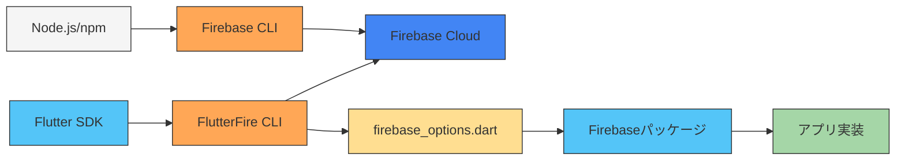
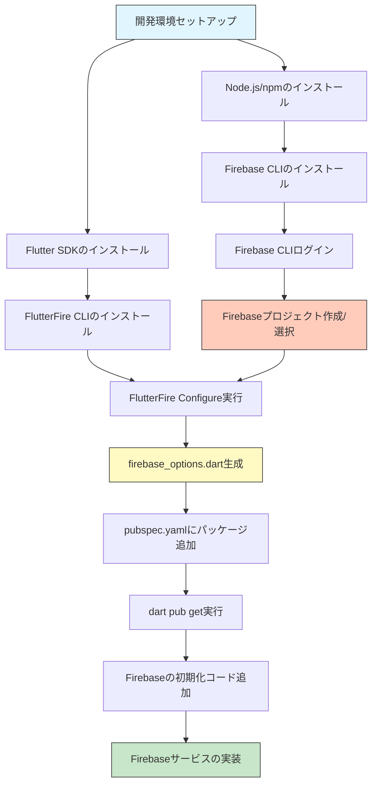
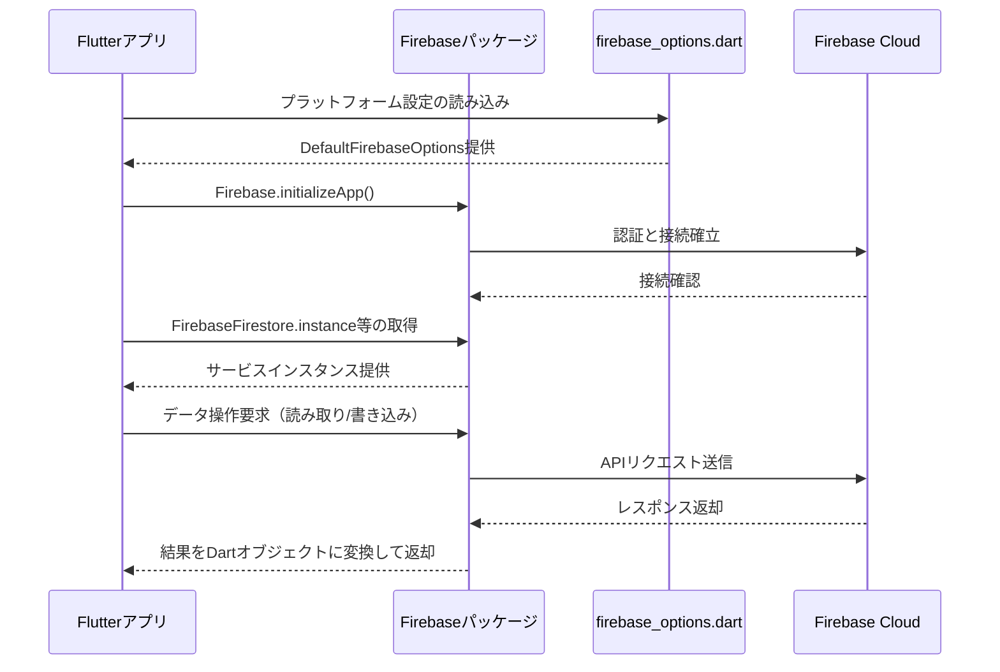

# Firebase設定とセットアップ

## 前提条件

| 項目 | 説明 |
|------|------|
| Node.js | JavaScriptランタイム環境。Firebase CLIの実行基盤となる |
| npm | Node.jsのパッケージ管理システム。Firebase CLIなどのインストールに使用 |
| Googleアカウント | Firebaseサービスの利用に必要。Firebase Consoleへのログインに使用 |
| Flutterプロジェクト | Firebase連携対象となるプロジェクト。Flutter SDKがインストール済みであること |
| Dart SDK | Dart 3.0以上を推奨。FlutterFire CLIの実行に必要 |

## Firebase CLIのインストール

Firebase Command Line Interface (CLI)は、Firebaseプロジェクトをコマンドラインから管理するためのツール。

```bash
npm install -g firebase-tools
```

`-g`オプションによりグローバルインストールされ、任意のディレクトリから`firebase`コマンドを実行可能になる。

インストールの確認:
```bash
firebase --version
```

## Firebase CLIへのログイン

インストール後、GoogleアカウントでFirebase CLIにログインする。

```bash
firebase login
```

このコマンドを実行すると:
1. ブラウザが自動的に開く
2. Googleアカウントでのログインを求められる
3. ログイン後、Firebase CLIはアカウントに関連付けられたプロジェクトにアクセス可能になる

ログイン状態の確認:
```bash
firebase projects:list
```

## Firebaseプロジェクトの作成

### Firebase Consoleでの作成
1. [Firebase Console](https://console.firebase.google.com/)にアクセス
2. 「プロジェクトを追加」をクリック
3. プロジェクト名を入力し、地域を選択
4. Googleアナリティクスの設定（オプション）
5. 「プロジェクトを作成」をクリック

### Firebase CLIでの作成（代替方法）
```bash
firebase projects:create [プロジェクト名]
```

作成後、Firebaseコンソールでプロジェクトの設定を確認し、**プロジェクトID**を控えておく。このIDは後のFlutterFire設定で必要となる。

## FlutterFire CLIのインストール

FlutterFire CLIは、FlutterプロジェクトにFirebaseを統合するためのツール。

```bash
dart pub global activate flutterfire_cli
```

インストール後、PATHを通す必要がある場合がある:

**Windows**:
```
%LOCALAPPDATA%\Pub\Cache\bin
```

**macOS/Linux**:
```
$HOME/.pub-cache/bin
```

インストールの確認:
```bash
flutterfire --version
```

## FlutterとFirebaseの連携

### プロジェクトの設定
1. Flutterプロジェクトのルートディレクトリに移動
2. 以下のコマンドを実行:

```bash
flutterfire configure --project=your-firebase-project-id
```

`your-firebase-project-id`は、作成したFirebaseプロジェクトのIDに置き換える。

このコマンドは以下の処理を行う:
1. サポートするプラットフォーム（iOS/Android/Web/macOS/Windows）を選択するよう促す
2. 選択したプラットフォーム用のFirebase構成ファイルをダウンロード
3. `firebase_options.dart`ファイルを生成

### firebase_options.dartについて

`firebase_options.dart`ファイルには以下の情報が含まれる:
- APIキー
- プロジェクトID
- アプリID
- メッセージ送信者ID
- ストレージバケット
- その他プラットフォーム固有の設定

このファイルは自動生成されるため、手動編集は推奨されない。再設定が必要な場合は`flutterfire configure`コマンドを再実行する。

## 必要なパッケージの追加

`pubspec.yaml`に必要なパッケージを追加する:

```yaml
dependencies:
  flutter:
    sdk: flutter
  
  # Firebase Core - 基礎パッケージ（必須）
  firebase_core: ^2.24.2
  
  # 以下は必要に応じて追加
  cloud_firestore: ^4.14.0  # Firestoreデータベース
  firebase_auth: ^4.15.3    # 認証機能
  firebase_storage: ^11.5.6 # ストレージ機能
  firebase_analytics: ^10.7.4 # 分析機能
  firebase_messaging: ^14.7.9 # プッシュ通知
  firebase_remote_config: ^4.3.8 # リモート設定
  firebase_crashlytics: ^3.4.8 # クラッシュレポート
```

パッケージの詳細:
| パッケージ | 説明 | 主な機能 |
|-----------|------|---------|
| firebase_core | Firebase SDKの基本機能 | Firebaseの初期化、複数アプリのサポート |
| cloud_firestore | NoSQLデータベース | CRUD操作、リアルタイム同期、オフラインサポート |
| firebase_auth | 認証サービス | メール/パスワード認証、SNS認証、匿名認証 |
| firebase_storage | ファイルストレージ | 画像/動画/ファイルのアップロード・ダウンロード |
| firebase_analytics | 使用状況分析 | ユーザー行動追跡、コンバージョン計測 |
| firebase_messaging | プッシュ通知 | FCMによる通知送信・受信 |
| firebase_remote_config | リモート設定 | アプリの動的設定変更 |
| firebase_crashlytics | クラッシュレポート | エラー分析、スタックトレース取得 |

パッケージのインストール:
```bash
flutter pub get
```

## Firebaseの初期化

アプリケーションでFirebaseを使用するには、まず初期化が必要。

```dart
import 'package:flutter/material.dart';
import 'package:firebase_core/firebase_core.dart';
import 'firebase_options.dart';

void main() async {
  // Flutter Widgetバインディングを確保
  WidgetsFlutterBinding.ensureInitialized();
  
  // Firebaseの初期化
  await Firebase.initializeApp(
    options: DefaultFirebaseOptions.currentPlatform,
  );
  
  runApp(MyApp());
}

class MyApp extends StatelessWidget {
  @override
  Widget build(BuildContext context) {
    return MaterialApp(
      title: 'Firebase Demo',
      theme: ThemeData(
        primarySwatch: Colors.blue,
      ),
      home: HomePage(),
    );
  }
}
```

`DefaultFirebaseOptions.currentPlatform`は`firebase_options.dart`ファイルに定義されたプラットフォーム固有の設定を自動的に選択する。

## 各コンポーネントの役割と全体像

### 各コンポーネントと役割

| コンポーネント | 役割 | 位置づけ | 備考 |
|--------------|------|---------|------|
| Node.js/npm | 開発環境のベース | 他のツールを動かすための基盤 | Flutter開発には直接関係ないがFirebase CLIに必要 |
| Firebase CLI | Firebaseコマンド実行ツール | ローカル環境とFirebaseクラウドの橋渡し | プロジェクト管理、デプロイ、エミュレータ実行などの機能 |
| Firebase Cloud | クラウドサービス群 | アプリのバックエンドシステム | データベース、認証、ストレージなどの各種サービス |
| FlutterFire CLI | 設定自動化ツール | Flutter開発環境とFirebaseの連携支援 | 設定ファイルの自動生成、マルチプラットフォーム対応 |
| firebase_options.dart | 接続情報ファイル | アプリとFirebaseを接続する「鍵」 | APIキー、プロジェクトIDなどの重要情報を含む |
| Firebaseパッケージ | Flutter用SDK | アプリでFirebase機能を実装するためのAPI | 各機能別にパッケージが分かれている |

### セットアップと実行フロー

#### 開発環境とツールの関係



#### セットアップフローの詳細



#### 実行時のデータフロー



### セットアップから利用までの流れ

1. **開発環境の準備**:
   - Node.js/npmのインストール
   - Flutter SDKのインストール
   - Firebase CLIのインストール
   - FlutterFire CLIのインストール

2. **プロジェクト設定**:
   - Firebase Consoleでプロジェクト作成
   - Firebase CLIでログイン
   - FlutterFire CLIで設定ファイル生成

3. **アプリ実装**:
   - pubspec.yamlに必要パッケージを追加
   - main.dartでFirebaseの初期化
   - 各機能（Firestore, Auth等）の実装

## プラットフォーム固有の設定

### Android

`android/app/build.gradle`で以下の設定を確認/追加:

```gradle
android {
    defaultConfig {
        minSdkVersion 21  // 最低限必要なSDKバージョン
        // その他の設定
    }
}
```

アプリレベルの`build.gradle`で以下も確認:
```gradle
dependencies {
    // 既存の依存関係
    implementation platform('com.google.firebase:firebase-bom:32.7.0')
}
```

`android/app/src/main/AndroidManifest.xml`にインターネット権限を追加:
```xml
<manifest xmlns:android="...">
    <uses-permission android:name="android.permission.INTERNET"/>
    <!-- 他の権限 -->
    <application
        ...
    </application>
</manifest>
```

### iOS

`ios/Runner/Info.plist`にURLスキームの設定（FlutterFire CLIが自動的に設定）:

```xml
<key>CFBundleURLTypes</key>
<array>
    <dict>
        <key>CFBundleTypeRole</key>
        <string>Editor</string>
        <key>CFBundleURLSchemes</key>
        <array>
            <string>com.googleusercontent.apps.YOUR-CLIENT-ID</string>
        </array>
    </dict>
</array>
```

必要に応じて、他のFirebase機能の設定も追加（Messaging等）。

### Web

`web/index.html`にFirebaseの初期化スクリプトを追加（FlutterFire CLIが自動的に設定）:

```html
<body>
  <!-- 既存のスクリプト -->
  
  <script src="https://www.gstatic.com/firebasejs/8.10.1/firebase-app.js"></script>
  <script src="https://www.gstatic.com/firebasejs/8.10.1/firebase-auth.js"></script>
  <script src="https://www.gstatic.com/firebasejs/8.10.1/firebase-firestore.js"></script>
  <!-- 必要に応じて他のFirebaseスクリプト -->
  
  <script>
    // Firebase設定
    var firebaseConfig = {
      apiKey: "...",
      authDomain: "...",
      projectId: "...",
      storageBucket: "...",
      messagingSenderId: "...",
      appId: "...",
      measurementId: "..."
    };
    // Firebase初期化
    firebase.initializeApp(firebaseConfig);
  </script>
  
  <!-- Flutter関連スクリプト -->
</body>
```

## Firestoreの基本的な使用例

### データの追加

```dart
import 'package:cloud_firestore/cloud_firestore.dart';

// Firestoreインスタンスの取得
final FirebaseFirestore firestore = FirebaseFirestore.instance;

// ドキュメントの追加（コレクション・ドキュメントIDを自動生成）
Future<void> addData() async {
  try {
    DocumentReference docRef = await firestore.collection('users').add({
      'name': 'John Doe',
      'email': 'john@example.com',
      'age': 30,
      'isActive': true,
      'registeredAt': FieldValue.serverTimestamp(), // サーバータイムスタンプ
    });
    print('Document added with ID: ${docRef.id}');
  } catch (e) {
    print('Error adding document: $e');
  }
}

// ドキュメントの追加（ドキュメントIDを指定）
Future<void> setData() async {
  try {
    await firestore.collection('users').doc('user123').set({
      'name': 'Jane Smith',
      'email': 'jane@example.com',
      'age': 25,
      'isActive': true,
      'registeredAt': FieldValue.serverTimestamp(),
    });
    print('Document set successfully');
  } catch (e) {
    print('Error setting document: $e');
  }
}
```

### データの読み取り

```dart
// 単一ドキュメントの取得
Future<void> getDocument() async {
  try {
    DocumentSnapshot doc = 
        await firestore.collection('users').doc('user123').get();
    
    if (doc.exists) {
      Map<String, dynamic> data = doc.data() as Map<String, dynamic>;
      print('Document data: ${data}');
      print('User name: ${data['name']}');
    } else {
      print('Document does not exist');
    }
  } catch (e) {
    print('Error getting document: $e');
  }
}

// コレクション内の全ドキュメント取得
Future<void> getAllDocuments() async {
  try {
    QuerySnapshot querySnapshot = 
        await firestore.collection('users').get();
    
    for (var doc in querySnapshot.docs) {
      print('${doc.id} => ${doc.data()}');
    }
    
    // List<Map>として処理する場合
    List<Map<String, dynamic>> allUsers = querySnapshot.docs
        .map((doc) => doc.data() as Map<String, dynamic>)
        .toList();
  } catch (e) {
    print('Error getting documents: $e');
  }
}

// クエリを使用したドキュメント取得
Future<void> queryDocuments() async {
  try {
    QuerySnapshot querySnapshot = await firestore.collection('users')
        .where('age', isGreaterThan: 25)
        .where('isActive', isEqualTo: true)
        .orderBy('age', descending: true)
        .limit(10)
        .get();
    
    print('Found ${querySnapshot.docs.length} documents');
    for (var doc in querySnapshot.docs) {
      print('${doc.id} => ${doc.data()}');
    }
  } catch (e) {
    print('Error querying documents: $e');
  }
}
```

### リアルタイムデータの監視（Stream）

```dart
// 単一ドキュメントのリアルタイム監視
Stream<DocumentSnapshot> documentStream() {
  return firestore.collection('users').doc('user123').snapshots();
}

// 使用例（Widgetでの活用）
Widget buildUserProfile() {
  return StreamBuilder<DocumentSnapshot>(
    stream: documentStream(),
    builder: (context, snapshot) {
      if (snapshot.hasError) {
        return Text('Error: ${snapshot.error}');
      }
      
      if (snapshot.connectionState == ConnectionState.waiting) {
        return CircularProgressIndicator();
      }
      
      if (!snapshot.hasData || !snapshot.data!.exists) {
        return Text('User not found');
      }
      
      Map<String, dynamic> userData = 
          snapshot.data!.data() as Map<String, dynamic>;
      
      return Column(
        children: [
          Text('Name: ${userData['name']}'),
          Text('Email: ${userData['email']}'),
          Text('Age: ${userData['age']}'),
        ],
      );
    },
  );
}

// コレクションのリアルタイム監視
Stream<QuerySnapshot> collectionStream() {
  return firestore.collection('users')
      .where('isActive', isEqualTo: true)
      .orderBy('name')
      .snapshots();
}

// 使用例（Widgetでの活用）
Widget buildUserList() {
  return StreamBuilder<QuerySnapshot>(
    stream: collectionStream(),
    builder: (context, snapshot) {
      if (snapshot.hasError) {
        return Text('Error: ${snapshot.error}');
      }
      
      if (snapshot.connectionState == ConnectionState.waiting) {
        return CircularProgressIndicator();
      }
      
      return ListView(
        children: snapshot.data!.docs.map((DocumentSnapshot document) {
          Map<String, dynamic> data = 
              document.data() as Map<String, dynamic>;
          return ListTile(
            title: Text(data['name']),
            subtitle: Text(data['email']),
            trailing: Text('Age: ${data['age']}'),
          );
        }).toList(),
      );
    },
  );
}
```

### データの更新

```dart
// ドキュメントの更新（一部フィールド）
Future<void> updateDocument() async {
  try {
    await firestore.collection('users').doc('user123').update({
      'age': 26,
      'lastUpdated': FieldValue.serverTimestamp(),
    });
    print('Document updated successfully');
  } catch (e) {
    print('Error updating document: $e');
  }
}

// ネストしたデータの更新
Future<void> updateNestedData() async {
  try {
    await firestore.collection('users').doc('user123').update({
      'address.city': 'New York',
      'address.zipCode': '10001',
      'tags': FieldValue.arrayUnion(['premium']), // 配列に要素を追加
      'score': FieldValue.increment(10), // 数値を増加
    });
    print('Nested data updated successfully');
  } catch (e) {
    print('Error updating nested data: $e');
  }
}
```

### データの削除

```dart
// ドキュメントの削除
Future<void> deleteDocument() async {
  try {
    await firestore.collection('users').doc('user123').delete();
    print('Document deleted successfully');
  } catch (e) {
    print('Error deleting document: $e');
  }
}

// 特定のフィールドの削除
Future<void> deleteField() async {
  try {
    await firestore.collection('users').doc('user123').update({
      'age': FieldValue.delete(),
      'tags': FieldValue.arrayRemove(['premium']), // 配列から要素を削除
    });
    print('Field deleted successfully');
  } catch (e) {
    print('Error deleting field: $e');
  }
}
```

### バッチ処理とトランザクション

```dart
// バッチ処理（複数の書き込みを一括で行う）
Future<void> batchWrite() async {
  try {
    WriteBatch batch = firestore.batch();
    
    // 新規ドキュメント追加
    DocumentReference newUserRef = firestore.collection('users').doc();
    batch.set(newUserRef, {
      'name': 'New User',
      'email': 'new@example.com',
      'createdAt': FieldValue.serverTimestamp(),
    });
    
    // 既存ドキュメント更新
    DocumentReference existingUserRef = 
        firestore.collection('users').doc('user123');
    batch.update(existingUserRef, {
      'lastLogin': FieldValue.serverTimestamp(),
    });
    
    // ドキュメント削除
    DocumentReference oldUserRef = 
        firestore.collection('users').doc('oldUser');
    batch.delete(oldUserRef);
    
    // バッチコミット
    await batch.commit();
    print('Batch operation completed successfully');
  } catch (e) {
    print('Error in batch operation: $e');
  }
}

// トランザクション（読み取りと書き込みを原子的に行う）
Future<void> runTransaction() async {
  try {
    await firestore.runTransaction((transaction) async {
      // ドキュメント読み取り
      DocumentSnapshot userSnapshot = 
          await transaction.get(firestore.collection('users').doc('user123'));
      
      if (!userSnapshot.exists) {
        throw Exception('User does not exist!');
      }
      
      // 現在のデータ取得
      Map<String, dynamic> userData = 
          userSnapshot.data() as Map<String, dynamic>;
      int currentPoints = userData['points'] ?? 0;
      
      // ポイント計算
      int newPoints = currentPoints + 100;
      
      // ドキュメント更新
      transaction.update(
        firestore.collection('users').doc('user123'), 
        {'points': newPoints}
      );
      
      // トランザクションの戻り値
      return newPoints;
    });
    
    print('Transaction completed successfully');
  } catch (e) {
    print('Transaction failed: $e');
  }
}
```

### セキュリティルール（Firebase Console）

Firestoreのデータアクセスを制御するセキュリティルールは、Firebase Consoleで設定:

```
// 基本的なセキュリティルール例
rules_version = '2';
service cloud.firestore {
  match /databases/{database}/documents {
    // 認証済みユーザーのみ読み取り可能
    match /users/{userId} {
      allow read: if request.auth != null;
      // 自分のデータのみ書き込み可能
      allow write: if request.auth != null && request.auth.uid == userId;
    }
    
    // 公開データは誰でも読み取り可能
    match /public/{document=**} {
      allow read: if true;
      allow write: if request.auth != null;
    }
  }
}
```