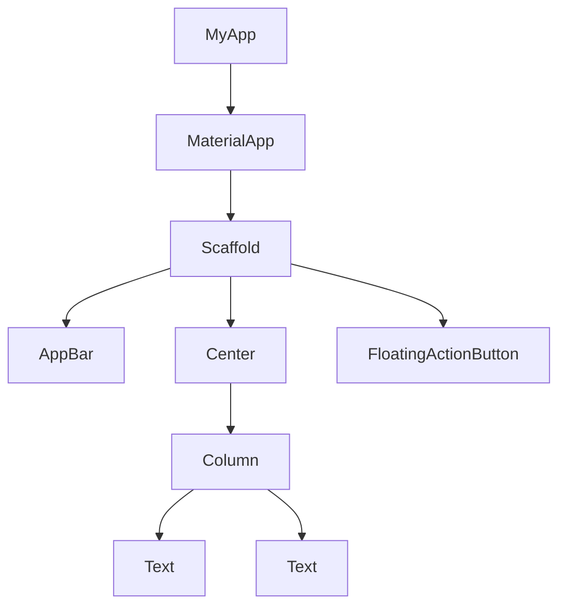

# Flutterウィジェットについて

## 1. Flutterウィジェットの基本

Flutterではすべての画面要素がウィジェットとして実装されている。ウィジェットは様々な方法で分類することができ、それぞれの役割や機能によって整理することができる。

### 1.1 ウィジェットの分類方法

Flutterのウィジェットは主に以下のような観点から分類できる：

- 目的・機能による分類
- 状態管理による分類
- 階層・役割による分類
- デザインシステムによる分類
- 特殊目的による分類

### 1.2 目的・機能による分類

| 分類/説明 | 主要なウィジェット | ウィジェットの説明 |
| --- | --- | --- |
| **表示ウィジェット** 視覚的要素を表示するウィジェット | Text | テキストを表示 |
|  | Image | 画像を表示 |
|  | Icon | アイコンを表示 |
|  | FlutterLogo | Flutterロゴを表示 |
| **入力ウィジェット** ユーザー入力を処理するウィジェット | TextField | テキスト入力フィールド |
|  | Checkbox | チェックボックス |
|  | ElevatedButton | 浮き出たスタイルのボタン |
|  | Switch | オン/オフトグル |
| **レイアウトウィジェット** 他のウィジェットの配置を制御 | Row | 水平方向に配置 |
|  | Column | 垂直方向に配置 |
|  | Stack | 重ねて配置 |
|  | Wrap | 折り返して配置 |
| **コンテナウィジェット** 装飾や余白を提供 | Container | 装飾、サイズ、位置調整 |
|  | Padding | 余白を追加 |
|  | Center | 中央に配置 |
|  | SizedBox | 特定のサイズを設定 |

### 1.3 状態管理による分類

| 分類/説明 | 主要なウィジェット | ウィジェットの説明 |
| --- | --- | --- |
| **StatelessWidget** 状態を持たない静的なウィジェット | Icon | アイコンを表示 |
|  | Text | テキストを表示 |
|  | Container | 装飾、サイズ、位置調整 |
| **StatefulWidget** 内部状態を持ち、動的に変化するウィジェット | TextField | テキスト入力フィールド |
|  | Checkbox | チェックボックス |
|  | Switch | オン/オフトグル |
|  | AnimatedContainer | アニメーション付きコンテナ |

### 1.4 階層・役割による分類

| 分類/説明 | 主要なウィジェット | ウィジェットの説明 |
| --- | --- | --- |
| **構造ウィジェット** アプリの基本構造を定義 | Scaffold | マテリアルデザインの基本構造 |
|  | AppBar | 上部のアプリバー |
|  | Drawer | 引き出しメニュー |
|  | BottomNavigationBar | 下部ナビゲーションバー |
| **InheritedWidget** ウィジェットツリーを通してデータを子孫に提供 | InheritedWidget | データ共有の基底クラス |
|  | Provider | 状態管理用のウィジェット |
|  | Theme | テーマデータを提供 |
|  | MediaQuery | デバイス情報を提供 |
| **アニメーションウィジェット** 動きを提供するウィジェット | AnimatedContainer | プロパティ変更時に自動アニメーション |
|  | AnimatedOpacity | 透明度のアニメーション |
|  | Hero | 画面遷移アニメーション |
|  | FadeTransition | フェードアニメーション |

### 1.5 デザインシステムによる分類

| 分類/説明 | 主要なウィジェット | ウィジェットの説明 |
| --- | --- | --- |
| **Material ウィジェット** マテリアルデザイン仕様に従ったウィジェット | MaterialApp | マテリアルアプリのルートウィジェット |
|  | Card | カード型コンテナ |
|  | ListTile | リスト項目のための標準レイアウト |
|  | FloatingActionButton | 浮動アクションボタン |
| **Cupertino ウィジェット** iOS のヒューマンインターフェースガイドラインに従ったウィジェット | CupertinoApp | iOSスタイルアプリのルートウィジェット |
|  | CupertinoButton | iOSスタイルのボタン |
|  | CupertinoNavigationBar | iOSスタイルのナビゲーションバー |
|  | CupertinoSwitch | iOSスタイルのスイッチ |

### 1.6 特殊目的ウィジェット

| 分類/説明 | 主要なウィジェット | ウィジェットの説明 |
| --- | --- | --- |
| **スクロールウィジェット** スクロール可能なコンテンツを提供 | ListView | 縦または横にスクロール可能なリスト |
|  | GridView | グリッド状に配置されたスクロール可能なリスト |
|  | SingleChildScrollView | 単一の子をスクロール可能にする |
|  | CustomScrollView | カスタムスクロール効果を実現 |
| **アクセシビリティウィジェット** アプリのアクセシビリティを向上 | Semantics | アクセシビリティ情報を追加 |
|  | ExcludeSemantics | 子のセマンティクス情報を除外 |
|  | MergeSemantics | 複数のセマンティクス情報をマージ |
| **ジェスチャーウィジェット** ユーザージェスチャーを検出 | GestureDetector | 様々なジェスチャーを検出 |
|  | InkWell | タップ時の波紋効果付きジェスチャー検出 |
|  | Dismissible | スワイプして削除可能なウィジェット |

## 2. Flutterアプリのデフォルト構造

Flutterアプリのデフォルト構造は以下のような階層になっている：

### 2.1 デフォルト構造のウィジェット分類

| ウィジェット | 分類 |
| --- | --- |
| **MyApp** | • 状態管理による分類: StatelessWidget • アプリのルートとなるカスタムウィジェット |
| **MaterialApp** | • デザインシステムによる分類: Material ウィジェット • 階層・役割による分類: 構造ウィジェット |
| **Scaffold** | • デザインシステムによる分類: Material ウィジェット • 階層・役割による分類: 構造ウィジェット |
| **AppBar** | • デザインシステムによる分類: Material ウィジェット • 階層・役割による分類: 構造ウィジェット |
| **Center** | • 目的・機能による分類: コンテナウィジェット/レイアウトウィジェット |
| **Column** | • 目的・機能による分類: レイアウトウィジェット |
| **Text** | • 目的・機能による分類: 表示ウィジェット • 状態管理による分類: StatelessWidget |
| **FloatingActionButton** | • デザインシステムによる分類: Material ウィジェット • 目的・機能による分類: 入力ウィジェット |

### 2.2 ウィジェットの分類の重複について

Flutterのウィジェットは複数の分類カテゴリに属することがある。例えば：

- **Center**は「コンテナウィジェット」と「レイアウトウィジェット」の両方の特性を持っている
- **FloatingActionButton**は「Material ウィジェット」であり「入力ウィジェット」でもある
- **TextButton**は「入力ウィジェット」でありながら、通常は「StatelessWidget」として実装されている

## 3. まとめ

Flutterのウィジェットは非常に多様で、様々な視点から分類できる。重要なのは、それぞれのウィジェットの役割と用途を理解し、適切に組み合わせることでユーザーインターフェースを構築すること。

1. **目的・機能による分類**：ウィジェットが何を表示し、どのような機能を提供するか
2. **状態管理による分類**：ウィジェットがどのように状態を管理するか
3. **階層・役割による分類**：ウィジェットがアプリ構造内でどのような役割を果たすか
4. **デザインシステムによる分類**：ウィジェットがどのデザインガイドラインに従っているか
5. **特殊目的による分類**：特定の機能に特化したウィジェット